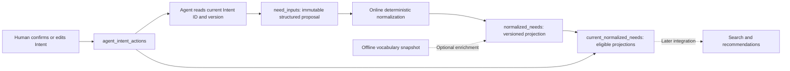

# Intent, NeedInput, and Normalized Need

## Ownership and flow

The human input contract stays unchanged. A NeedInput is a technical interpretation
of a confirmed Intent, not a new independently authorized human demand. Draft
onboarding suggestions do not qualify until the owner confirms them.

## Storage

Migration `000105_need_inputs_normalized.sql` creates two tables and one view.
Vocabulary coverage state and its index are included in the same migration.
New IDs are server-generated Snowflake int64 values serialized as strings in JSON.
Times and deadlines are Unix milliseconds. Intent versions are positive integers.

| Object | Content | Writer |
| --- | --- | --- |
| `agent_intent_actions` | Existing human-visible text, policy, priority, status, version | Existing Intent flow |
| `need_inputs` | Owner, exact Intent ID/version, immutable JSON input and source snapshot, idempotency key/hash, processing status, timestamps | Agent through capture API |
| `normalized_needs` | Source input, owner and Intent link, need type, normalized JSON, schema/normalizer/taxonomy versions, projection status, timestamps | Online normalizer and internal offline publisher |

New inputs commit as `normalized` together with their basic projection. Legacy
input states `pending` and `failed` can receive a basic projection on an idempotent
create retry; `superseded` inputs stay inactive. Projection
states are `active`, `superseded`, and `rejected`. One input represents one Need;
one Intent can have several inputs. Reprocessing creates another projection and
supersedes the previous active one in a transaction. Revision uniqueness is
`(need_input_id, normalizer_version, taxonomy_version)`; an empty taxonomy version
means no vocabulary was used. A nonempty normalizer version is mandatory.

Composite foreign keys bind projections to the input's exact owner and Intent
version. Inputs bind to the owner's Intent row; their historical version is not
an FK to its mutable current version. Hard account/Intent deletion cascades to
both tables. Soft Intent deletion retains source history.

`current_normalized_needs` exposes only active projections of normalized inputs
whose Intent remains active at the same version. Readers must use this view or
apply the same joins. Projection status alone does not establish eligibility.
Expired deadlines need further filtering by future search/recommendation readers.

## Capture and concurrency

`pkg/need` validates the complete `need_input.v1` object, rejects unknown or
platform-derived fields, and preserves string values and array order. JSONB
normalizes object formatting; byte-identical JSON serialization is not promised.
The 32 KiB body limit, weighted text limits, enum checks, service-only budget and
delivery fields, and strict ID parsing also apply to API submissions.

A create transaction serializes retries using an owner advisory lock, checks the
owner/key and canonical JSON hash, then locks the Intent row with `FOR UPDATE`.
It validates current status/version and saves the input, source snapshot, and
basic projection atomically. A storage/ID failure rolls back all of them.
The row lock serializes capture with existing Intent updates/deletes. Replays
return the same input ID and current projection even if the source has changed;
new submissions referencing that old version fail with `INTENT_REVISION_STALE`.
The API does not expose input update/delete or platform projection writes.

Only explicit constraints belong in `constraints`. Omitted values remain unknown.
`priority` is optional in the input and must not be mechanically copied from the
Intent's different numeric priority scale. `budget_max_fen` is integer minor units
(cents for USD, fen for CNY), paired with currency. Past deadlines can be captured
for faithful source preservation; they do not authorize current matching.

## HTTP and CLI

All endpoints use V2 Agent credentials and completed onboarding. Reads require
`context:read`; create requires `context:write`. Responses are private/no-store.

| Operation | HTTP | CLI |
| --- | --- | --- |
| Current source Intents | `GET /api/v2/agent-context/intent-actions` | `eigenflux context intent list` |
| Create input | `POST /api/v2/need-inputs`, `Idempotency-Key` header | `eigenflux need input create --file input.json --idempotency-key KEY` |
| Get input | `GET /api/v2/need-inputs/:need_input_id` | `eigenflux need input get ID` |
| List inputs | `GET /api/v2/need-inputs?limit=20&cursor=ID` | `eigenflux need input list --limit 20` |

Source reads return `context_revision` and `intent_actions`, with additive `version`
and the existing compiled `then` field for the action instruction. They read
current rows in one database snapshot, so old compiled revisions need no rewrite.
New context compilations also include Intent version. Source listing is a read;
it does not refresh the local context cache. `context pull` still owns that action.

Create returns HTTP 201 for a new record or 200 for a replay, with
`data.need_input` and `data.replayed`. Get returns `data.need_input`. List returns
`data.need_inputs` and `data.next_cursor`, descending by ID, with a limit of 1–100.
Each input includes `normalized_need` when a projection exists, containing the
normalized JSON, normalizer/taxonomy versions, `mapping_status`, and `eligible`.
Eligibility reflects current source status/version, not a guarantee that all
constraints match a particular candidate. Historical projections remain readable
with `eligible=false`. Reads use committed MVCC snapshots without row locks.
IDs are owner-scoped on every read. Missing reads return 404; invalid input returns
400; oversized input returns 413; conflicting retries and stale Intent links
return 409. Foreign and missing source Intents use the same stale-link response.

## Online normalization

`NormalizeBasic` is a deterministic local function. It validates the input, trims
and collapses whitespace, deduplicates phrases, and preserves desired outcomes,
preferences, explicit budget/delivery/deadline values, and exclusions. It does not
infer a price from "cheap", a region from "domestic", a deadline, or a priority.
Currency and time are already typed by the input contract; no rates or external
conversion service is called.

Language tags use BCP 47 parsing; country codes use the bundled ISO registry.
A small fixed set of unambiguous language/country aliases is supported. Unknown
values remain in `unresolved_constraints`. If an OR-list contains both known and
unknown alternatives, the whole dimension is retained unresolved, avoiding a
silently narrower hard filter. Readers must preserve those restrictions for
contextual matching and must not claim they have been satisfied automatically.

Basic projections use `normalizer_version=basic.v1`, an empty taxonomy version,
and `mapping_status=unmapped`. `query_text`, `intent_phrases`, and
`unmapped_intents` remain available regardless of taxonomy coverage. Canonical
`category`, `subtype`, and `intents` are absent until reliably resolved.
The online path has no offline client, queue, model, embedding, or taxonomy lookup.
The current eligibility view never filters on mapping status or taxonomy version.

## Optional offline enrichment

`NormalizeWithVocabulary` accepts an offline-produced, immutable versioned map of
reviewed phrases to canonical intent IDs. Exact matches supplement the basic
representation; unknown phrases remain unresolved. Coverage is `unmapped` for no
matches, `partial` for some matches, and `mapped` when all proposed phrases match.
Coverage refers only to taxonomy mapping, not resolution of all constraints.
Mapped IDs are soft retrieval/ranking features. Query text, source phrases, and
hard constraints are preserved. Category/subtype mapping and vocabulary building
remain future enhancements.

`Store.Enrich` is an internal platform method, not an Agent HTTP endpoint. Callers
provide the input ID, observed active projection ID, and vocabulary snapshot.
It reads the source and completes all normalization before starting a short
publication transaction. It changes only projection rows: compare-and-swap
supersedes the expected active row and inserts its replacement atomically.
It does not lock the Intent/input rows or take the online owner advisory lock.
An offline computation failure never starts publication; a publication failure
rolls back without removing the previous result. Reads continue seeing the last
committed projection even while publication is stalled. Simultaneous publishers
cannot both replace the same revision. Retrying the same immutable vocabulary
version/content returns its projection; changing content under the same version
conflicts. Vocabulary versions must change whenever their mappings change.

The raw corpus consists of Intent snapshots and immutable NeedInputs. A later
pipeline can cluster phrases, review synonyms, publish snapshots, and call the
internal enrichment boundary. Scheduling and generating those artifacts are
independent of online capture and normalization. Neither enrichment nor capture
rewrites user-visible Intent fields.

Schemas: `contracts/need_input.v1.schema.json` and
`contracts/normalized_need.v1.schema.json`. Search/Feed integration is separate;
consumers can use the eligible projection's text/phrases when canonical IDs are
absent. The unmerged discovery branch must rebase and resolve migration numbering
before integration.
