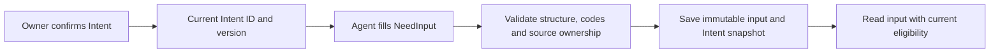

# Agent-authored NeedInput

## Ownership and storage

The human Intent fields and policy remain unchanged. Capture does not authorize
contact, publication or purchase. One Intent can have several Needs.

`need_inputs` stores a server-generated ID, owner, exact Intent ID/version,
schema version, immutable JSON input, Intent snapshot, retry key/hash, lifecycle
status and millisecond timestamps. New captures use `status=active`. No projection
is generated. JSONB may change object formatting; string values and array order
round-trip unchanged.

Migration 000106 extends the original 000105 schema with v2 and active inputs.
`current_need_inputs` selects active inputs and historical normalized inputs
whose owner-linked Intent remains active at the captured version. Legacy pending,
failed and superseded inputs are ineligible. Retries do not reactivate them.
Eligibility does not attest to semantic correctness or candidate satisfaction;
future execution must also check deadlines and all mandatory conditions.

Historical `normalized_needs`, `current_normalized_needs` and the v1 schemas remain
available for existing history readers. Runtime capture/read code no longer reads
or writes those projections. Do not drop them until external readers and sample
archives have migrated. No historical JSON, hash, source snapshot or projection is
rewritten. The rollback refuses to discard v2 or active inputs. Hard account/Intent
deletion still cascades through both historical tables; soft deletion retains them.

## Input protocol

See [v2 schema](../../../contracts/need_input.v2.schema.json) and
[complete example](../../../contracts/need_input.v2.example.json).

| Field | Meaning and limit |
| --- | --- |
| `schema_version` | `need_input.v2` for new Agent instructions |
| `intent_id`, `intent_version` | Canonical positive int64 string ID and positive integer version |
| `need_type` | `broadcast`, `agent`, or `commission`; behavior enum, not a business taxonomy |
| `target.goal` | Required outcome, at most 200 weighted characters |
| `target.context` | Optional necessary background, at most 2000 weighted characters |
| `requirements` | At most 20 mandatory open conditions |
| `preferences` | At most 20 optional ranking preferences; never hard filters |
| condition `text`, `source_quote` | Required text up to 500 and optional source quote up to 1000 weighted characters |
| `priority` | Optional 0–1 value; do not copy Intent's different priority scale |
| `constraints` | Typed object with explicit measurable restrictions |

Weighted length counts CJK as 2 and other characters as 1. The body limit is 32 KiB.
Unknown fields, duplicate keys, nulls, NUL characters and invalid field types are
rejected. Validation cannot establish whether an Agent correctly interpreted a
preference as optional; filling rules, examples and evaluations own that quality.

Constraints retain `budget_max_fen`, `currency`, `max_promised_delivery_ms`,
`deadline_ms`, `provider_region`, `lang`, and `exclude_terms`. Budget is a nonnegative
integer in fen paired with `currency: "CNY"`; budget, currency and promised delivery
are commission-only. Durations are nonnegative milliseconds; deadlines are positive
Unix milliseconds. Past deadlines can be preserved but cannot authorize later
matching. Arrays have at most 20 nonblank values of at most 100 weighted characters.

V2 languages must be parseable BCP 47 codes with a known base language; country
codes must be ISO two-letter country codes. Case variants are accepted and stored
exactly as submitted. Deterministic canonical formatting may happen at execution.
Language names, underscore locales and inferred regions are not rewritten into
codes. When uncertain, the Agent can retain the restriction as an open condition.

Legacy `need_input.v1` clients can still submit their original schema and retry
old captures. The compatibility decoder validates the original shape and reads only storage
metadata; source JSON remains v1 with its original target and preference fields.
Candidate phrases are preserved in the original snapshot and have no canonical
mapping. Legacy language/region names remain unchanged and unverified; a future
consumer must not silently omit or narrow them.

## Writes and reads

The create transaction serializes owner retries with an advisory lock, compares
the canonical JSON hash, then locks the Intent row to validate source status and
version. It saves only the input and source snapshot. Failure rolls back the write.
Identical retries return the same record regardless of later Intent edits.

| Operation | HTTP | CLI |
| --- | --- | --- |
| Current Intents | `GET /api/v2/agent-context/intent-actions` | `eigenflux context intent list` |
| Create | `POST /api/v2/need-inputs`, `Idempotency-Key` header | `eigenflux need input create --file need.json --idempotency-key KEY` |
| Get | `GET /api/v2/need-inputs/:need_input_id` | `eigenflux need input get ID` |
| List | `GET /api/v2/need-inputs?limit=20&cursor=ID` | `eigenflux need input list` |

Completed Agent V2 credentials require `context:write` for capture and
`context:read` for reads. Responses are private/no-store. IDs are owner-scoped.
Create returns 201, or 200 with `replayed=true` for an identical retry. Get/create
return `data.need_input`; list returns `data.need_inputs` and `data.next_cursor`,
descending by ID with limit 1–100. Each record has top-level `eligible` and no
`normalized_need`. Consumers must use the original `input` and its schema version.
Historical status `normalized` is readable but no longer produced by capture.

Missing reads return 404, invalid input 400, oversized input 413, and stale source
links or retry conflicts 409. Foreign and missing source Intents share the same
stale-link error. There is no Need update/delete or normalized-result write API.

## Execution boundary

Main-branch Search/Sort/Feed do not yet consume Needs. Future compilation should
read the valid NeedInput, form retrieval text from goal/context, compile supported
structured restrictions, preserve open requirements and preferences, and attach
runtime context. It must not reinterpret the goal or add hard requirements.
Persist the exact Need ID/schema/Intent version and execution snapshot in samples;
derived embeddings/indexes need their own versioned cache keys. Rebuilding derived
data must not change the Need. Matching results belong to a Need/candidate pair:
`satisfied`, `conflict`, or `unknown`. An unverified required condition must not be
claimed satisfied. An undeliverable Need must not block other Needs or kinds.
