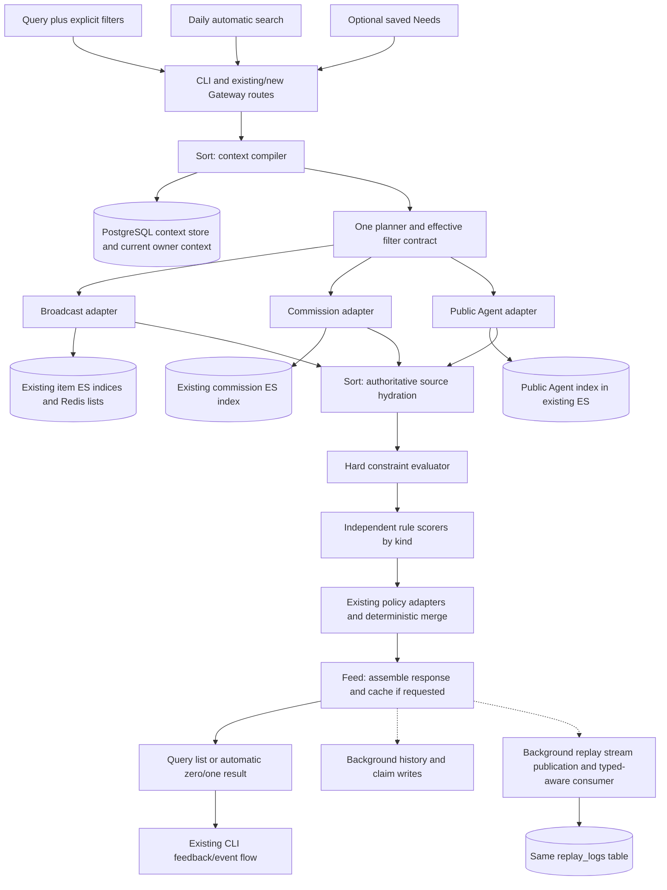

# Search and Recommendation MVP — Technical Design

Status: Revision 3, incorporating D01–D14, all three source kinds, and the Owner-approved delivery simplification.
Date: 2026-09-22. Code baseline: `origin/main` at `9a532e79`.

Implementation is based on `340417c6`. See [implementation tracking](implement.md) and the [executable contract](../../dev/discovery.md) for final API/storage names, bounded execution choices, validation evidence and outstanding cutover gates. The architecture below retains the reviewed design context.
Companions: [PRD](prd.md), [Decision record](questions.md).
Reference: [architecture proposal, revision 83](https://pcnlty6lw65j.feishu.cn/docx/KRPPdM4xWoDgcrxsl2gcMRfVn8g).

## 1. Architecture and fixed boundaries

The logical service runs inside existing Gateway, Sort, and Feed deployments. Sort owns context compilation, optional saved Needs, planning, retrieval, hard filtering, and scoring. Feed owns response assembly/caching, impression identity, and best-effort recording. Gateway owns auth and old/new HTTP adapters. No new service process or infrastructure cluster is required.

There are two public modes: **query search** and **automatic search**. Structured Needs are an optional input/control mechanism, not a required onboarding step. The first release supports `broadcast`, `commission`, and `agent`. All three use rules; later model development, parameter count, version, and rollout are independent per kind. Section 3.6 defines the extension contract without implementing model serving.



Reverse matching, offline production pipelines, training/calibration/serving, new feedback semantics, holding queues, and a new scheduler are excluded. Source sections 3.7–3.9 supply existing policy/delivery/event implementations, not new standalone modules.

### 1.1 Verified reuse and gaps

| Current code | Reuse / gap |
|---|---|
| `rpc/sort/legacy/pipeline.go`, `rpc/sort/dal/es_query.go` | Reuse query primitives, not the old profile/LR orchestration; add context-based execution |
| `pkg/es/mapping.go` | Add canonical slots to existing broadcast indices and templates; preserve text/vector/group/expiry fields |
| `pkg/commissionindex/{types,es}.go`, `rpc/sort/legacy/commission.go` | Reuse commission index, active/tombstone contract, price/currency/duration/statistics, exact-ID lookup |
| `pkg/agentcard/builder.go`, `api/consolev2/feed_handlers.go` | Current Card projections and frozen `agent_context_revisions` supply authenticated owner context; Agent candidates use public Card fields only |
| `pkg/recallsource`, `pkg/recall` | Reuse current versioned hot/new/UGC lists and reader patterns; Need-seeded Swing remains disabled |
| `rpc/sort/rank`, `rpc/sort/rerank` | Reuse pure policy transforms through kind-aware adapters |
| `rpc/feed/handler.go`, `pkg/feedcache` | Reuse impression/serving/legacy pagination primitives, with new namespaces and context snapshots |
| `pkg/replaylog/events.go`, `pipeline/consumer/replay_*` | Reuse stream, consumer, delivered-only records, and idempotent insert |
| `cli/internal/feedevent` | Reuse broadcast ledger/queue/events, adding exact impression context and explicit-search cache adaptation |

No equivalent public Agent lexical/dense/slot index was verified. Add a small rebuildable Agent index to the existing ES cluster; do not claim Console Home's rule recommendations are already Need-based search. The current replay table requires broadcast `item_id`, and the CLI ledger uses latest impression by item ID. Typed samples and exact context attribution require real compatibility changes.

## 2. Top-level interfaces

HTTP IDs are decimal strings; internal IDs are `i64/BIGINT`; stored timestamps are Unix milliseconds. Keep `{code,msg,data}` with object `data`. Owner identity comes from auth, never a client `agent_id`. New routes reuse V2 auth/onboarding and existing read/write scope conventions. Old routes retain their auth and feature/allowlist gates.

### 2.1 Unified HTTP and CLI

| Route | Input and purpose | CLI facade |
|---|---|---|
| `POST /api/v2/discovery/search` | Exactly one of `query`, `need_id`, or inline `need`; optional kinds, explicit filters, limit | `search <query> --types ...`; `search --need <id>` |
| `POST /api/v2/discovery/recommendations` | Automatic mode, optional kinds/owned Need IDs; no query required | Existing daily feed/poll facade; optional unified `recommend` command |
| `GET /api/v2/taxonomy/search` | Phrase plus optional category/subtype; top 10, maximum 20 | `taxonomy search <phrase>` |
| `POST /api/v2/needs` | Create one saved structured Need | `need create --file need.json` |
| `GET /api/v2/needs` / `GET /api/v2/needs/{id}` | Owner list with cursor / detail | `need list/get` |
| `PUT /api/v2/needs/{id}` | Replace editable specification with expected revision | `need update` |
| `POST /api/v2/needs/{id}/state` | Pause/resume/complete with expected revision | `need pause/resume/close` |

These names are implementation proposals; the two-mode and three-kind semantics are confirmed. Reject client-written vectors, compiled filters, scorer versions, DSL, and ownership fields. Cross-owner IDs use non-disclosing not-found behavior. Unknown input fields and mutually exclusive inputs produce structured field errors.

Serving/create calls accept owner-scoped `Idempotency-Key`: same key/body returns the same IDs for 24 hours; different body conflicts. Replay the assembled response without rechecking Need/source state; new requests observe current state. Need create idempotency is durable; serving idempotency is Redis-backed and errors retriably if that guarantee cannot be maintained.

### 2.2 Query search

```json
{
  "query": "landing page designer for an early-stage product",
  "source_kinds": ["commission"],
  "filters": {
    "category": "design",
    "subtype": "web_design",
    "budget_max_fen": 300000,
    "currency": "CNY",
    "lang": ["en"]
  },
  "limit": 20
}
```

Taxonomy labels above are illustrative. `query` is nonempty, up to 2,000 weighted characters; use the project's weighted validator. `source_kinds` is a unique subset of the three supported kinds, default all three. Limit defaults to 20, maximum 50 across the response. Category, outcome, proposed intents, and saved Need ID are not required for raw query search.

Supported hard filters are category/subtype, explicit canonical intents if expressed as a filter, budget/currency, absolute deadline, provider region, language, exclude authors, and exclude terms. Unlike Need `target.intents` relevance evidence, an explicitly requested `filters.intents` predicate is hard; use distinct normalized fields to avoid conflating them. Filters must be applicable to every requested kind: budget/delivery-promise filters require commission-only scope; otherwise return field errors rather than silently ignore the condition for Agents/broadcasts. Explicit canonical IDs require their taxonomy version. Existing route range filters are handled by adapters below.

Taxonomy suggestions inferred from query are soft retrieval signals. Do not promote them to hard category/subtype constraints. Free-text numbers/negation remain search text unless accompanied by explicit filters; return `effective_filters` and `constraint_mode="explicit_filters"` so clients cannot mistake an unparsed sentence for a verified budget. No server generative LLM is introduced; use rules, lexical analysis, taxonomy lookup, and the existing embedding client.

For `need_id` or inline `need`, use the structured Need's target/constraints; reject an additional top-level filter body rather than create precedence ambiguity. A requested kind set must include only that Need's primary kind. Inline Needs use the same strict compiler as saved Needs, but are ephemeral. Query search never reads automatic dedup state or falls back to Agent context.

### 2.3 Automatic search and fallback

Automatic mode defaults to all kinds on the unified API. Existing typed routes constrain kinds before selecting contexts. Select at most five active Needs from a maximum of ten, ordered by priority, then updated time, then ID. Explicit `need_ids` must be owned, active, in scope, and bounded; invalid IDs are errors. Return zero or one discovery result across the selected contexts/kinds.

| Situation | Execution | Observable result |
|---|---|---|
| In-scope active Needs exist | Execute those Needs and all explicit filters | `input_origin=saved_need`; no profile/baseline broadening on no-match |
| No in-scope active Needs | Use current frozen Agent intent/context and Card query adapter | `input_origin=agent_context`, `fallback_reason=no_active_needs` |
| Context has no usable demand/interest text | If broadcast allowed, take a bounded existing new/hot pool | `input_origin=baseline`, `fallback_reason=empty_agent_context` |
| Empty context, only commission/agent requested | No invented preference or unrelated type | Empty `insufficient_context` |
| Optional semantic/recall channel unavailable | Other channels under identical hard filters | `partial=true` and failed-channel reason |
| Required owner/authority data unreadable, all useful retrieval channels fail | Error | Nonzero code, never a false no-match or generic fallback |

For Agent context, read canonical current owner sources rather than deprecated `agent_profiles` query fields. When a current frozen context revision exposes `intent_actions`, use bounded `watch_for`/`trigger_when` search clauses and preserve the referenced intent ID; never execute `then` as an instruction. Otherwise use existing Card `demands`, `seeking`, and `current_focus`; use `interests_positive` only if no demand/focus clauses exist. Up to five clauses share the request budget. Keep each clause separate rather than concatenate a whole bio/goal/Card. Use stable source ordering; no model infers missing priority or creates saved Needs. Only the current owner can access their private context.

This ordering is the concrete default implementing D03/D04, not an additional owner claim about exact fallback fields. Do not parse Card prose into hard price, region, or taxonomy filters. Inherited languages require explicit opt-in; owner geography never becomes provider geography. An explicit API filter on an old recommendation route remains hard even when using Agent-context fallback. Invalid/stale saved Need taxonomy or failed Need loading must be reported, not mistaken for an empty active list.

Baseline is a last-resort automatic broadcast list with current availability, visibility/self/block/exclusion checks, freshness/quality rules, and existing cross-request dedup. It has no fabricated relevance score, Need, or canonical target. Do not bypass a real query's relevance gate by relabeling its empty result as baseline. Recommendation of people never causes contact, friendship, or other external actions.

### 2.4 Response and empty/error contract

```json
{
  "code": 0,
  "msg": "success",
  "data": {
    "request_id": "req_example",
    "impression_id": "imp_example",
    "mode": "search",
    "input_origin": "query",
    "context_id": "234567890123456789",
    "pipeline_version": "need_search_v1",
    "effective_filters": {"lang": ["en"]},
    "constraint_mode": "explicit_filters",
    "items": [{
      "source_ref": {"type": "agent", "id": "123456789012345678"},
      "preview": {"text": "Public Agent capability summary"},
      "match": {"fields": ["offering"], "scorer_type": "rules", "scorer_version": "agent_rules_v1"}
    }],
    "result_status": "ok",
    "partial": false,
    "fallback_reason": null,
    "has_more": false
  }
}
```

Broadcasts additionally retain `item_id == source_ref.id`. Commission/Agent results never invent broadcast `item_id`. Include `need_id/need_revision` only for an actual structured Need; all inputs have an immutable compiled `context_id`. An automatic multi-context result carries the selected context on the result and a compact selection summary. Public previews use existing disclosure limits and public DTOs. Scores/diagnostics are internal unless an explicit debugging surface permits them; field-match summaries are deterministic facts, not generated explanations.

Successful empty `result_status` is `no_match`, `below_threshold`, `exhausted`, or `insufficient_context`. Baseline success is identified by origin/fallback fields, not hidden inside ordinary personalization. Optional channel failure is partial; required failure is an error. Field errors contain `{path,reason,allowed_values?}` under `data.errors`; numeric API codes follow the existing registry. Unified APIs have no pagination; `has_more=false` promises no continuation, not complete corpus exhaustion.

### 2.5 Existing routes: direct replacement, compatible adapters

At cutover all affected discovery routes call the new execution path by default; no account/client opt-in. Preserve existing routes, auth gates, response shape, disclosure policies, and separate notifications. Typed legacy endpoints retain their kind restriction:

| Existing surface | Adapter behavior |
|---|---|
| V1 item Feed and existing V2 Feed poll | Automatic, broadcast-only; Needs → owner context → baseline; at most one discovery result per response |
| V1/V2 commission recommendations | Automatic, commission-only; carry existing explicit range filters; no arbitrary baseline |
| V1/V2 commission query search | Query, commission-only; existing query and numeric filters enter the common context |
| Commission exact `commission_id` lookup | Preserve existing exact zero/one ES lookup and active/range constraints; skip embedding and relevance gate; retain this compatibility-only boundary |
| Existing CLI feed, commission search/recommendations | Keep command entry/auth/output wrappers; engine changes underneath |
| Unified discovery routes / `search --types agent` | Expose multi-kind and people search without forcing legacy broadcast DTOs to hold people |

Old commission `min/max_price_fen` and duration-range arguments compile into optional inclusive range predicates and intersect with any relevant hard constraint. Preserve zero versus absence and reject contradictory bounds. Duration ranges remain durations; a new absolute deadline adds `now+duration<=deadline`, not a reinterpretation of an old parameter. Keep existing parameter acceptance where possible; unified search caps at 50, existing commission search keeps its documented limit up to 100 in the adapter with a separately bounded candidate/hydration budget.

Preserve legacy Feed cursor/`has_more`/`load_more` semantics using a new pipeline-namespaced bounded cache of ranked candidates and frozen context references. Each automatic response returns at most one discovery item; remaining prefetched eligible candidates may form later pages. Pages retain their Need/ranking snapshot and use the existing item detail lookup during assembly; skip missing/non-completed candidates without an extra Sort validation RPC. Record only returned items, with the original impression and absolute positions across that page lifecycle. Need edits/closure affect new executions rather than invalidating frozen pages. Clear or isolate old pipeline pages at cutover; never mix generations within one impression. Unified APIs do not expose this compatibility-only pagination.

A server-controlled rollback switch can restore old route implementations operationally; it is not the normal fallback policy and must report actual pipeline/scorer versions. No production action is performed by this document task.

### 2.6 Internal interfaces and identity

Add methods/types through existing IDLs and code generation; preserve legacy field/method IDs. Need CRUD and taxonomy enter Sort. New serving methods enter Feed, which calls context-based Sort execution; legacy methods act as adapters, not parallel new ranking implementations.

```text
CompileStructuredNeed(owner, input, taxonomy, permitted_defaults) -> CompiledContext
CompileQuery(owner, query, explicit_filters, kinds, versions) -> CompiledContext
CompileAgentContext(owner, current_snapshot, kinds, versions) -> CompiledContext[]
BuildPlan(context, mode, config, request_now) -> Plan{filters, channels, budgets}
Recall(plan, channel) -> CandidatePair[]
CheckHardConstraints(filters, source_snapshot, now) -> Pass | Reject | Unavailable
ScoreByKind(context, source, features, frozen_scorer, now) -> ScoreResult
RetrieveContexts(owner, context_refs, mode, now) -> typed ranked candidates
```

`CandidatePair` key is `(context_id,source_kind,source_id)`; a saved-Need context also carries Need ID/revision. Store per-channel scores/ranks, source labels, slot matches, expansion flags, typed content revision, constraint evidence, and features. The legacy source bitset is a full `uint8`: never reuse/renumber its persisted bits. New channels use a separate label list, retaining existing labels where meanings match.

## 3. Online module design

### 3.1 Compiler — primary focus

All inputs compile to `CompiledContext{context_id,input_origin,mode,kinds,query_clauses,soft_slots,hard_filters,vector_ref,source_revision,versions}`. Structured Need, raw query, Agent context, and baseline are distinct schemas with one execution representation. A raw query is not forced to invent an outcome, priority, or category. Baseline has no query vector and uses its own eligibility/score type.

**Structured Need schema.** Agent-authored `need_type`, priority, target category/subtype, ≤5 optional canonical intents, ≤10 original proposed phrases, original wording, outcome, optional preferences, and constraints. Need types map to the three primary kinds. Priority `[0,1]`; maximum ten active Needs per owner. Original wording ≤2,000 weighted characters; outcome/preferences ≤500; exclusions bounded to 20 each. Require category, wording, outcome, and proposed phrases. System owns identity, revision, state, versions, and effective defaults.

Saved/inline Need input retains the explicit field layout below; examples use illustrative taxonomy names:

```json
{
  "need_type": "find_people",
  "priority": 0.8,
  "target": {
    "category": "design",
    "subtype": "web_design",
    "intents": [],
    "proposed_intents": ["landing page design collaborator"],
    "free_text": "Find a collaborator who designs landing pages."
  },
  "outcome": "Identify a suitable person to discuss a landing page project with.",
  "constraints": {"lang": ["en"], "exclude_authors": []},
  "preferences": "Experience with early-stage products is preferred.",
  "defaults": {"language": "none", "provider_region": "none"}
}
```

`constraints` accepts optional `budget_max_fen`/`currency`, `deadline_ms`, `provider_region[]`, `lang[]`, `exclude_terms[]`, and `exclude_authors[]`, subject to the kind applicability rules. It does not accept client-authored filter DSL. In particular, people Needs reject budget/delivery-promise requirements that only a catalogue can verify. Need responses include normalized editable fields, `need_id`, `revision`, `state`, timestamps, versions, `effective_constraints`, field origins, and mapping warnings; vectors stay internal. Updates require `expected_revision`; conflict responses identify the current revision without silently merging.

**Validation and compilation sequence:**

1. Authenticate ownership; validate fields/types/lengths/enums and cross-field applicability. Canonical subtype belongs to category; explicit intent IDs belong to the selected branch and supplied taxonomy version. Budget requires a supported same-unit currency and a commission target. Reject elapsed deadlines for active Needs and exact normalized target/exclusion contradictions; do not claim semantic contradiction detection.
2. Normalize controlled codes and aliases without changing user meaning. Explicit target category/subtype and explicit filters become hard. Need target intents and inferred query/Agent taxonomy matches remain soft relevance signals. If canonical intents are missing, branch-scoped embedding lookup may suggest up to five above-threshold IDs; never force the nearest one. Preserve raw phrases and misses.
3. Apply only agreed defaults: always self-exclude, language only on explicit Card-default opt-in, no owner-geo/provider-location inheritance, no automatic hard negatives from interests/offering. Record `explicit`, `card_default`, or `system` origin and source Card revision.
4. Embed structured Need `outcome + original wording + preferences`; embed raw query as query; embed each bounded Agent clause separately. Do not append Agent profile/history to explicit query or Need text. Record model/version/dimensions, normalization and template version. Existing embedding client only, no generative compilation.
5. For saved/inline structured Needs, validate/map/embed before committing a complete row; failure leaves the old revision intact or new object absent. For raw/Agent search, embedding failure may execute a documented lexical-only partial context with vector-missing evidence. It must not masquerade as a fully compiled saved Need.
6. Commit source snapshot and compiled context; use expected revision for Need writes. Verify authoritative Need state/revision when starting a new execution. In-flight execution and assembled response/page snapshots remain usable until cache expiry.

Generative `server_fallback` is not implemented. `compiled_by` is `agent` for submitted structured Needs or `rules` for query/Agent normalization; `input_origin` carries the semantic distinction. Request-time context snapshots and concurrency revisions do not add the deferred authority engine or user-facing revision-history product.

**Taxonomy.** Shared `rpc/sort/discovery/index` loads a reviewed immutable JSON asset containing canonical nodes, parents, aliases, descriptions, and frozen term embeddings. Bounded in-memory cosine lookup is sufficient initially; Redis caches by vocabulary/embedding version. No new taxonomy vector DB or monthly builder. Preserve misses in context/Need text and counters/logs, no separate miss workflow/table. Activate a taxonomy version only when compatible content projections are ready; explicit stale IDs error, and inferred matches from incompatible versions cannot become hard filters. Bootstrap artifact ownership and readiness remain launch dependencies.

### 3.2 Need lifecycle

Saved Needs support `active ↔ paused`, `active/paused → completed`, and time-based `expired`. Deadline reads immediately exclude expired objects without a new expiry scheduler. Completion is explicit, not inferred from feedback. Terminal Needs are recreated rather than silently resumed. CRUD can only address saved Needs, not ephemeral query/context snapshots. Resume/create active-limit checks run in the same owner-scoped transaction lock as the write.

Pausing/completing all Needs may cause the next **general** automatic poll to use the documented Agent-context fallback. Calling automatic search with explicit paused/completed Need IDs instead returns an error. Closing a Need does not mean disabling all future discovery; user-wide enable/disable controls remain those of existing polling/settings.

### 3.3 Planner, budgets, and cross-kind combination

One immutable `Filters` object represents effective hard constraints for each context and kind. Adapters compile it; they do not reinterpret prose. Pushdown may admit extra candidates for authoritative recheck, but must not create false negatives relative to the evaluator. Missing capability/evidence cannot silently drop a requested filter.

Explicit category/subtype require exact canonical matches and matching taxonomy version. Raw query/Agent contexts without explicit categories can search legacy documents lexically/semantically; this is absence of a constraint, not relaxation of one. Structured recall is off when there are no suitable slots. Unknown explicit fields fail closed. Soft intents improve recall and ranking but never make an unknown hard category pass.

Starting per-context broadcast quotas: lexical 80, dense 80, structured 40, hot 20, new 20, UGC 10; union cap 200. Commission/Agent each use lexical/dense/structured with cap 100. Deduplicate per context/kind; merge channel ranks by fixed quotas/round-robin, not incomparable raw scores. Query mode disables hot/new/UGC and exposure-injection filler. An automatic request evaluates up to five contexts, with at most three contexts and six backend calls concurrently; hard global cap 1,000 pairs. Multi-kind contexts divide that cap before execution. Legacy limit-100 commission search has a bounded exception pool of up to 300 for hydration; it never creates unbounded fan-out.

Query merging: produce per-kind ranked lists, then round-robin the requested kinds in explicit client order or default `broadcast, commission, agent`; skip exhausted kinds, stop at total limit, dedup typed sources. This is deterministic coverage, not a claimed global relevance order. A single-kind query is ordinary ranked search. Reserve per-kind capacity so a high-volume broadcast pool cannot exclude people/services.

Automatic merging: choose qualifying context winners by saved-Need priority; at equal priority use stable context order, then per-kind configured order. Within one kind/context use its rule score and ID tie-breaker. Agent-context clauses have stable source order, not invented learned priority. Fairness/weighted rotation is deferred; lower-priority Needs may starve as accepted in D10. Fixed primary kinds avoid comparing model/rule scales in future upgrades.

### 3.4 Forward retrieval and index reuse — primary focus

| Source/channel | Reused assets | Changes |
|---|---|---|
| Broadcast lexical/dense | Current `items-*`, keyword/domain/text fields and embeddings | Query/vector from compiled context; real lexical hit required; unified filters |
| Broadcast structured | Same indices with additive slots | Exact explicit target predicates, optional soft intent recall |
| Hot/new/UGC | Current Redis versioned lists/producers | Automatic only; ES `ids` + common filters and relevance recheck except explicitly unpersonalized baseline |
| Swing | Existing neighbor storage remains available | New context/Need path disabled; `surface` is not adoption |
| Friend | Existing separate friend/relationship entry | Not a relevance-bypass source in the new engine |
| Commission | Existing index/alias, `search_text`, vector, catalogue/statistics fields | Context query/filter adapters; source hydration; preserve exact-ID path |
| Agent | Current public Card/domain truth and existing ES cluster | Add a small public discovery index with lexical/dense/slot adapters; no reuse of deprecated profile embeddings |

**Broadcast/commission additive fields:** `slots.category/subtype/intents` and `taxonomy_version`; verified `slots.provider_region`, normalized `slots.lang`; broadcast `state` and `state_updated_at`. Use keyword fields for normalized IDs/codes and date for state time. Preserve all current text, vectors, group IDs, expiry, and source metadata. Commission already has integer price/currency/duration: no generic floating-point price fields are needed. Candidate kind comes from the adapter.

Source projection must persist normalized evidence with a content/source revision rather than let ES be its sole truth. Propose `processed_items.retrieval_slots JSONB` for broadcasts; commission needs corresponding metadata owned by its current source/projection boundary. Do not directly modify a foreign service's tables. The exact authoritative commission extension and provider field source remain integration readiness tasks. Mapping changes apply to existing backing indices and future templates, not just a new template.

**Agent index contract:** separate alias `agents-discovery` with a versioned backing index in the existing cluster. One document per Agent: `agent_id`, public Card revision, public description/offering text, `working_languages`, permitted `last_active_at`, discoverable/status projection, canonical taxonomy slots, optional publicly declared provider region, and an embedding of public capability text only. Do not index owner-private `geo`, demands, interests, private human details, or legacy profile embeddings for other people's searches. Public seeking may contribute contextual willingness only where existing public Card visibility permits it; it is not a guarantee of consent to transact.

Reuse existing discoverability/Card access rules rather than create a new contact permission system. Recheck viewer-specific self/block/relationship exclusions through the authoritative domain. `find_people` excludes existing friends or active conversations for new-contact discovery; literal query search may rediscover already-known people but never blocked/inaccessible/self results. These are mode-specific eligibility rules recorded with the plan. Existing relationship queries need a bounded batch adapter if they are currently per-ID.

Card update/deletion/visibility changes must refresh/tombstone the Agent projection through existing Card-change infrastructure or its projection hook, with monotonic public revision protection. Final serving reads the current public Card/relationship state. Initial projection population, vocabulary annotation, and missing provider evidence must be ready before cutover; this document defines their contract, not an offline pipeline implementation. No arbitrary bulk JSON scan of all Cards in the online path.

Verified legacy completed/nondeleted/nonexpired broadcasts may initialize availability; `state_updated_at=updated_at` is an approximation explicitly marked as such. Never fabricate canonical categories, public provider geography, or price from absent fields. Constrained slot retrieval requires sufficient projection coverage; unconstrained query/Agent search can use current text/vector fields. A new Agent index is an explicit additional workload for the confirmed third kind.

### 3.5 Hard constraint evaluation — primary focus

Return `Pass`, `Reject(reason)`, or `Unavailable` for dependency failure. Unknown required evidence rejects. Authority read failure is not a negative label or a successful no-match. No authority-tier exemption or ranking override can reopen a failed hard condition.

| Condition | Broadcast | Commission | Agent |
|---|---|---|---|
| Visibility/state | Authorized completed, nondeleted, nonexpired item | Active visible catalogue/provider | Current accessible/discoverable public Card and eligible account |
| Explicit category/subtype | Canonical exact match/version | Same | Same public projection |
| Need target intents | Soft relevance | Soft relevance | Soft relevance |
| Explicit intent filter | Required canonical intersection | Same | Same |
| Budget/currency | Unsupported filter | Known integer price ≤ budget, exact currency | Unsupported: an offering is not a price commitment |
| Deadline | Expire request/Need, not invented document recency | Need alive and `now+promised_duration<=deadline` | Expire search Need only; no delivery commitment inferred |
| Provider region | Verified declared provider region, not content geography | Verified public seller/provider evidence | Explicitly public declared provider evidence, never private Card geo |
| Language | Content language intersects allow-list | Provider working languages intersect allow-list | Public working languages intersect allow-list |
| Author/self exclusions | Author ID | Seller ID | Candidate Agent ID |
| Block/relationship | Existing visibility/block rules | Existing provider access/block rules | Block/self always; known-friend/conversation suppression in automatic new-contact discovery |
| Exclude terms | Canonical labels, keywords, summary/searchable text | Tags/title/capability/delivery text | Permitted public searchable capability text |

Missing required category, price, currency, language, or region rejects. Known zero price is valid. Positive delivery duration is required unless the commission domain explicitly supports zero-duration delivery. Mixed-kind requests with unsupported hard conditions fail validation rather than ignore conditions on one kind. All evaluator inputs carry source/version/evidence provenance.

Use one Unicode normalization/case-folding contract for literal exclude phrases, with token boundaries for space-delimited text and normalized substring semantics for CJK. This is lexical exclusion, not inferred semantic negation. ES pushdown only when equivalent; final evaluator covers the full bounded field set. Regional/language code expansion must be explicit and versioned.

Hydrate the merged candidates once per context from authoritative sources before hard filters and rule scoring. This supplies source visibility/status, mutable prices/promises, public Card/relationship state and evidence versions. Mandatory authority failure errors; removed or index-version-mismatched candidates can be skipped. Do not reread Need state or hydrate the ranked output again. Need/rule state is frozen for the execution. Legacy Feed assembly already fetches item details and skips missing/non-completed items. Assembled responses and idempotent retries do not call `Revalidate`; short-lived inconsistency with later source changes is accepted.

### 3.6 Per-kind rules now; independently evolving scorers later

The MVP does not call legacy `rpc/sort/lrranker`, learned relevance models, or generative pairwise scoring, including ordinary Agent-context fallback. Embeddings are existing retrieval representations. Maintain a scorer registry keyed by source kind and mode; each entry has `scorer_type`, `scorer_version`, `feature_schema_version`, `config_hash`, and output `score_kind`. The pipeline version is independent of those values.

Starting rule examples, subject to reviewed-example adjustment (D09):

```text
slot = 0.15*category_match + 0.25*subtype_match + 0.60*intent_overlap_fraction
lexical = bm25 / (bm25 + k_kind_mode)
semantic = clamp((cosine - floor_kind_mode)/(1-floor_kind_mode), 0, 1)
relevance = max(slot, 0.55*lexical + 0.45*semantic)

broadcast = 0.85*relevance + 0.10*freshness + 0.05*quality
commission = 0.85*relevance + 0.10*fulfillment + 0.05*budget_slack
agent = 0.90*relevance + 0.10*public_activity_freshness
```

All terms `[0,1]`; absent target slots/intent denominator contribute zero, not division by zero. Missing source features contribute zero with flags and no silent weight renormalization. Semantic similarity is computed for all candidates with compatible available vectors, not only dense-channel hits. Normalize fulfillment from existing completion/rating/evidence fields; missing is not perfect. Budget slack is `max(0,1-price/budget)` for positive known budget, 1 for known zero-price/zero-budget match, otherwise zero. Do not invent Agent response/completion statistics that have not been implemented. Activity freshness is based on a permitted real activity timestamp, not Card edit time.

Require relevance eligibility before boost/injection, then a kind/mode-specific score threshold. Numbers from revision 1 (relevance 0.45; broadcast 0.50; commission 0.55) are fixture starting points only, not approved release settings. Agent thresholds and query-versus-automatic differences must be set from reviewed examples. Review all three kinds, both modes, cold/unknown evidence, constrained no-match, and Agent-context fallback. Store the accepted example set and config checksum; release depends on that review rather than unexplained constants.

Baseline uses a separate rule `baseline_quality_v1` over freshness/quality and existing policies; it has `score_kind=baseline_score`, no Need relevance gate, and can execute only in the fallback state defined in 2.3. Exact-ID lookup uses `score_kind=exact_lookup`, not fabricated semantic relevance. Ordinary rule scores are `rule_score`, never probabilities, expected utility, or cross-kind comparable values.

Freeze features, contributions, missing flags, unboosted/final scores, thresholds, policy reasons, request time, and actual per-kind scorer versions in samples. Future broadcast model adoption can replace only its registry entry/version while commission/Agent remain rules; independent release/rollback/size/configuration is a hard architecture requirement. Do not add a model loader, serving RPC, trainer, or calibration job this release. Multi-kind selection remains explicit policy, not mixed model/rule score sorting.

### 3.7–3.9 Reuse with necessary adapters

Normal path: recall → authoritative hydration → hard check → rule scoring → relevance eligibility → applicable existing boost/freshness/group/injection policies → dedup/source limits → response assembly/cache → independent background recording. Existing friend/UGC threshold bypass and exploration append cannot bypass context constraints/relevance. Injection sees only eligible candidates; empty reserved slots stay empty. Baseline's separate eligibility is explicit and cannot be reached to evade a failed Need.

Reuse broadcast group collapse/Bloom and UGC claim behavior in automatic mode. Nonbroadcast identity is `(kind,id)` and has no invented broadcast group. Extend the same automatic dedup adapter with separate typed served-ID keys for commission/Agent, matching the existing recommendation history window; never collide IDs or put them in broadcast feedback sets. Final multi-context merge returns a source only once with one primary context and optional secondary matches.

Query search deduplicates typed IDs and applicable groups within the response only. It neither reads nor writes automatic Bloom, served-ID, or UGC claim state. Returned search broadcasts use `impr:search:agent:<id>:items` with the existing 30-day feedback-validation TTL; the existing validator accepts either old automatic or search sets. Exact attribution uses the impression. Automatic broadcasts still use `impr:agent:*`. This prevents explicit search from affecting legacy Swing exclusion via the old impression set.

CLI continues using its existing cache/event queue and retry ownership. Add exact `(item_id,impression_id)` context lookup, retaining latest-item lookup for legacy callers. Ambiguous contextless events remain valid legacy events where currently accepted but must not be labeled as exact Need outcomes. Commission actions retain current domain attribution; people PM/friend actions remain domain actions. No new event kinds, automatic Need mutations, weighted fairness, holding queue, interruption budget, or generated explanation service. Need-seeded Swing remains off.

## 4. Storage and caches

### 4.1 One new context store

Use a single proposed PostgreSQL `discovery_contexts` table for saved Needs and ephemeral compiled searches, rather than forcing raw queries to satisfy the Need schema or adding several tables. Fields: `context_id` PK; owner `agent_id`; `persistence` (`saved`/`ephemeral`); `input_origin`; `state`; optional `need_type/priority`; `input JSONB`; `compiled JSONB`; optional embedding/vector payload and version; taxonomy/compiler versions; revision; source revision; spec hash; optional deadline; created/updated/expiry timestamps; create idempotency key/hash.

For `persistence=saved`, public `need_id` equals `context_id` and strict Need invariants apply. Raw query/Agent/baseline rows are ephemeral contexts, have no public Need identity, and never appear in Need lists/active limits. Inline structured Need is an ephemeral Need with typed input provenance. Preserve snapshots for 30 days, covering the eight-day CLI ledger. Replay copies the necessary immutable snapshot so later context cleanup cannot alter historical attribution. A reused cached Agent context gets a new request/impression, not a false new user-authored Need.

Indexes: owner/state/priority/context for saved active selection, owner/update/context for listing, expiry for bounded maintenance, and owner/idempotency uniqueness. No general JSON scanning in the hot path. Owner-scoped transaction checks enforce ten active Needs. Saved Need state/revision and Agent source context are read when execution starts, then frozen for that execution. Source facts are hydrated once before filtering/scoring. New requests observe changes; cached assembled responses do not revalidate them. Existing account deletion/reset must include contexts and caches.

### 4.2 Redis namespaces

| Proposed key | Contract |
|---|---|
| `agent:<id>:needs:active` | Optional derived hint; indexed DB selection verifies membership/state |
| `discovery:context:<id>:<revision>` | Immutable compiled snapshot; owner checked separately |
| `discovery:emb:<owner>:<spec_hash>:<embedding_version>` | Need/query/Agent-clause vector reuse, never profile-vector substitution |
| `discovery:plan:<owner>:<context>:<revision>:<mode>:<config>` | Include taxonomy/embedding/source/kind versions in config hash; evaluate time bounds at request time |
| `discovery:candidates:<owner>:<input_hash>:<filters_hash>:<versions>:<kind>:<channel>:<time_bucket>` | Short-lived raw candidate cache, source hydration before scoring |
| `discovery:idempotency:<owner>:<key_hash>` | Response/impression/body binding |
| `discovery:feed:<pipeline>:<owner>:<impression>` | Compatibility-only legacy pages with absolute positions and frozen contexts |
| `discovery:seen:<owner>:<kind>` | Automatic-only nonbroadcast served IDs; current recommendation-history TTL |
| `impr:search:agent:<id>:items` | Explicit-search broadcast feedback validation only |
| `cache:taxonomy:<version>:<embedding>:<query_hash>` | Shared public vocabulary lookup |

Reuse SingleFlight and existing Redis helpers. Candidate TTL can begin at the existing two seconds. Do not reuse profile-only cache hashes, old feed queues, or a cache key lacking mode/kind/effective filters/source revision. Redis cache loss may fall back to bounded authoritative reads; it must not rewrite the input mode or discard hard constraints.

## 5. Existing samples with explicit generations

### 5.1 Table and stream contract

Reuse `stream:replay:log`, the existing consumer group, and `replay_logs`. Preserve delivered-only granularity: one returned source at an absolute position in an impression. No rows for recalled-only, rejected, or empty decisions; those have request logs/metrics. `delivered=true` is returned to the Agent, not confirmed human attention. Historical false/NULL flags and original scores remain unchanged.

| Additive column | Meaning |
|---|---|
| `pipeline_version TEXT DEFAULT 'legacy_feed_v1' NOT NULL` | New engine `need_search_v1`; independent of the active scorer |
| `request_mode TEXT DEFAULT 'feed' NOT NULL` | Legacy `feed`, explicit `search`, automatic `recommendation` |
| `sample_schema_version INT DEFAULT 1 NOT NULL` | New snapshots use 2 |
| `need_id`, `need_revision` nullable BIGINT | Only actual structured Needs; no invented Need for Card/query/baseline |
| `source_kind TEXT DEFAULT 'broadcast' NOT NULL` | Broadcast, commission, or agent |
| `source_id BIGINT NULL` | Typed source ID; legacy NULL resolves to broadcast item ID |

Keep broadcast `item_id` correct. Allow it to be NULL for commission/Agent and require valid typed `source_id`; never write another kind's ID, a group ID, zero, or a sentinel into it. Keep unique `(impression_id,position)`. Context ID, input origin, fallback, exact-lookup marker, and per-kind scorer metadata live in namespaced JSON snapshots, avoiding a column for every feature.

Old producer events decode to old defaults. New engine always sends explicit pipeline/mode/schema fields, including Agent-context and baseline fallback; it is never mislabeled legacy merely because it reused a recall list. An operational rollback running old code reports legacy metadata and the actual legacy scorer. Consumer-first rollout is mandatory: old consumers discard unknown fields and cannot safely decode nullable nonbroadcast IDs. Drain/replace all old consumers before new producers publish.

### 5.2 Frozen context, kind, and scorer evidence

History/claim updates and sample publication are independent best-effort background writes, each bounded to two seconds and detached from request cancellation. Neither is atomic with response/page caching; failures emit logs/counters and do not fail the response. Accept temporary duplicate recommendations, lost samples and feedback join misses; no durable outbox or repair-on-retry is required. Consumers retain `(impression_id,position)` deduplication. Idempotent cache replay does not create another exposure.

Preserve legacy JSON keys consumed by current readers. Add `agent_features.search_context` containing immutable input/compiled context, origin, optional Need reference, source Card/context revisions, effective filters/default origins, taxonomy/embedding/compiler versions, mode, request time, and fallback reason. For a query list the context is shared; multi-context automatic delivery has one selected context plus compact secondary matches. Public responses never expose private input snapshots.

`item_features.search` contains typed source/version, context ID and optional Need reference, channel evidence, normalized slots, filter facts, features/missingness, contributions, thresholds, policy reasons, `scorer_type`, `scorer_version`, `feature_schema_version`, `config_hash`, and `score_kind`. Examples: `broadcast_rules_v1`, `commission_rules_v1`, `agent_rules_v1`; baseline and exact lookup have their own score kinds. `item_score` is meaningful only together with this metadata. Future broadcast model versions do not require changing the commission/Agent scorer versions or pipeline marker.

Preserve request context via `pkg/reqinfo`. If runtime fields are present, use product `runtime_name/runtime_version`, integration `runtime_mode`, and latest reported `model`; unknown stays unknown. Do not resurrect deprecated runtime identity or infer model/runtime from a plugin version.

Broadcast feedback joins by `(impression_id,agent_id,item_id)` to recover the original context/Need. Contextless ambiguous events are not assigned to the latest Need. Commission/Agent delivery samples are present, but new cross-domain training-label joins/event classes remain excluded. Missing feedback is unknown, not a negative label. Delivered-only reuse does not claim full counterfactual/rejected-candidate reconstruction.

### 5.3 Reader compatibility and rollback

Before cutover audit beat coverage, official feed rescue, PGC SQL views, console analytics, cleanup/reset, and external sample exports/trainers. Legacy models must select legacy pipeline rows. Broadcast-only readers select broadcast kind; automatic-delivery counters include `recommendation` and legacy feed but exclude explicit `search` unless their metric explicitly means all discovery delivery. Baseline should be separately identifiable in analysis. Do not silently train on a mix of rule scores, old LR probabilities, and future model scores.

Add an index on pipeline/mode/time; retain existing impression/time retention indexes. A Need/time index is optional if actual diagnostics need it. External reader readiness is a compatibility release dependency, not permission to redesign their offline training here. Routing rollback retains additive data, context rows, and typed-aware readers/consumers; old nonnullable readers cannot be restored while typed rows exist.

## 6. Verification and direct cutover

Use request deadlines, bounded fan-out/hydration, and batched source/relationship checks. Optional channel errors yield observable partial results without weakening constraints; all meaningful retrieval or mandatory authority failures return errors. Saved-Need compilation embedding failure is atomic/retriable; raw/Agent input may take the explicit lexical-only partial path. Do not treat a missing/failed context lookup as authorization to show baseline.

Accepted provisional targets: automatic five-context P95 ≤500 ms; compiled single-context search ≤300 ms; compilation/inline ≤2 s. Existing embedding and multi-kind cold execution need measurement, and no unmeasured SLA is claimed. Use bounded metric labels for mode/kind/channel/reject/fallback/scorer outcome; high-cardinality identities belong in traces. Preserve existing asynchronous replay loss semantics and monitor publication/consumer failures.

Cutover sequence: additive storage/mappings → verified three-kind projections and taxonomy → typed-aware sample consumers/readers → two-mode engine and legacy adapters → reviewed examples/contract/E2E/load checks → server-controlled replacement of existing routes. A short controlled shadow/canary validates cutover; final behavior is default replacement without user opt-in. Shadow must not create delivered rows, write history/claims, send feedback, acknowledge notifications, or mutate relationship state.

| Test group | Required evidence |
|---|---|
| Inputs | Raw query without Need/category; three kinds; structured Need validation; distinct Card/query provenance; explicit filters vs inferred soft slots |
| Automatic fallback | Need → context → baseline matrix; no context-only service/person filler; no constrained no-match broadening; required read failure remains error |
| State/auth | Owner isolation, revision races, active-limit concurrency, expiry, pause/complete semantics, current Agent context revision |
| Retrieval | Same hard filters per channel; lexical hit requirement; unconstrained legacy-document compatibility; strict explicit slot evidence; bounded union/three-kind merge |
| People | Public-only index; visibility/delete revision; self/block checks; automatic known-contact suppression; query rediscovery; no PM/friend side effects |
| Rules | Reviewed fixtures for every kind/mode; no legacy LR invocation; missing features; separate baseline/exact score kinds; per-kind independent versions |
| Policies/history | No relevance bypass; query only within-request dedup; preserved automatic history; nonbroadcast IDs isolated; legacy page detail assembly |
| Samples/CLI | Same stream/table; old/new decoding; nullable typed identity; consumer-first gate; exact context joins; old labels preserved; no rows for rejected/empty results |
| Replacement | Existing routes/auth/range/exact-lookup contracts; old CLI compatibility; maximum-one automatic delivery; cursor/absolute positions preserved; no stale pre-cutover pages |
| Load/failure | Warm/cold embeddings, maximum contexts/kinds/candidates, source authority failure, partial channels, cancellations, bounded retries and hydration |

Implementation must use repository IDL/codegen, build, local service, package/E2E, and separate CLI/console checks for changed modules. This revision edits documentation only and makes no claim that future code tests have passed. No production deployment is authorized.

## 7. Implementation surfaces and remaining dependencies

Expected changes: context/Need/taxonomy packages and DAL; additive IDL methods/types; raw-query and Agent-context compilers; per-kind recall/filter/scorer adapters; additive broadcast/commission slots and new public Agent index; current source projection contracts; typed Feed hydration/history/page adapters; replay producer/consumer/readers; legacy route replacement; CLI query/Need/exact-context adapters; synchronized Agent Skill instructions.

Follow `skills/AGENTS.md` before editing Skills. Agent behavior stays in dynamically synchronized Skills, shared auth/account/event state in CLI, and host scheduling/process/context collection in adapters. Console and CLI remain independent modules.

Unresolved implementation dependencies, not repeated product questions: approved initial taxonomy asset/owner; reviewed relevance examples and accepted per-kind/mode configurations; authoritative public provider fields/commission projection integration; public Agent projection and batched relation readiness; external sample-reader compatibility; measured workload sizes. Record outcomes in the decision document before implementation reaches those gates. Offline pipelines and model training/serving remain outside this task.
