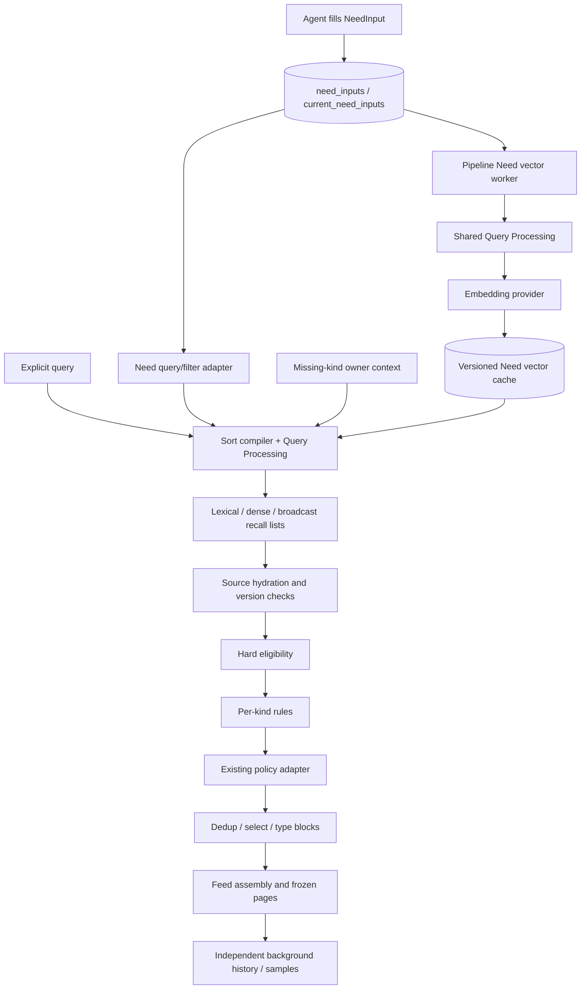

# Search and Recommendation MVP — Technical Design

Status: current implementation contract. All three kinds launch together:
broadcast, commission/service and public Agent. This document covers interfaces
and online modules; model training and offline enrichment architecture are out of
scope. See [PRD](prd.md), [historical owner answers](questions.md),
[module contract](../../dev/discovery.md) and [code index](../../../rpc/sort/README.md).

## 1. Architecture and boundaries

Sort owns input compilation, recall, authoritative eligibility, scoring and
ordering. Feed owns result assembly, frozen pages, idempotent response caches and
background delivery recording. Existing HTTP/RPC envelopes remain the transport
boundary. Capture/history belong to `pkg/need`, not Sort. Pipeline projects
candidate indexes and precomputes saved-Need query vectors.

Use the existing PostgreSQL, ES cluster, Redis, replay table/stream, policy
reranker and CLI feedback events. No additional microservice is required.
`ENABLE_NEED_SEARCH` switches existing typed routes to the new implementation;
legacy ranking remains available when disabled.


```mermaid
flowchart TD
    Capture[Agent fills NeedInput] --> DB[(need_inputs / current_need_inputs)]
    DB --> Worker[Pipeline Need vector worker]
    Worker --> QP[Shared Query Processing]
    QP --> Model[Embedding provider]
    Model --> Cache[(Versioned Need vector cache)]
    DB --> Need[Need query/filter adapter]
    Query[Explicit query] --> Compile[Sort compiler + Query Processing]
    Need --> Compile
    Owner[Missing-kind owner context] --> Compile
    Cache --> Compile
    Compile --> Recall[Lexical / dense / broadcast recall lists]
    Recall --> Hydrate[Source hydration and version checks]
    Hydrate --> Filter[Hard eligibility]
    Filter --> Score[Per-kind rules]
    Score --> Policy[Existing policy adapter]
    Policy --> Merge[Dedup / select / type blocks]
    Merge --> Feed[Feed assembly and frozen pages]
    Feed --> Record[Independent background history / samples]
```

Owner-context compilation skips embedding entirely. Explicit queries and inline
Needs compute on demand; saved Needs read the asynchronous cache. ES stores
candidate vectors. All three candidate Redis forward projections contain scalar
features and source evidence only.

## 2. Top-level interfaces

### 2.1 Unified entry points

| Method | Route | Behavior |
| --- | --- | --- |
| POST | `/api/v2/discovery/search` | Exactly one of query, explicit Commission ID, internal saved Need reference, or internal inline Need |
| POST | `/api/v2/discovery/recommendations` | Select eligible Needs, then fallback independently for uncovered kinds |

Both require authenticated completed-onboarding access and `feed:read`.
Commission authorization applies before serving Commission results. Owner IDs
come from authentication, never request JSON. Need capture remains at
`/api/v2/need-inputs` and the versioned capture-maintenance routes.

CLI commands are `eigenflux search <query>` and `eigenflux recommend`. Need IDs
are platform internals and are not exposed as search/recommend flags. There is
no vocabulary lookup route, CLI command or capability.

Search defaults to all three kinds and 20 results per page; maximum page size is
50. A cursor binds owner, input, kinds, filters, defaults and page size to a
frozen ranking of at most 200 results for 24 hours. Recommendations default to
20, allow up to 100 and may return fewer. Exact hits lead their own type block.
Scores are never compared across types to allocate blocks.

### 2.2 Input and filter contract

NeedInput v2 maps `target.goal + target.context` to query text. Typed language,
provider region, budget/currency, deadline, promised duration and exclusions map
to supported filters. Preserve source JSON, Intent ID/version, requirements and
preferences. Open requirements do not block all retrieval, and a returned
candidate does not certify those prose requirements. Unsupported legacy code
restrictions return no candidates for that Need rather than being dropped.

Explicit query accepts kinds, limit, cursor, defaults and business filters.
Price/currency/duration constraints require Commission-only scope. Provider
geography never inherits owner geography. Card language is inherited only when
explicitly requested via defaults. Plain query numbers are not promoted into
guaranteed budget/deadline restrictions.

Removed category/subtype/standard-intent/version fields are rejected by strict
request decoding. Historical source records and snapshots remain readable;
there is no active normalization or vocabulary dependency.

### 2.3 Automatic fallback and empty results

Select up to five current eligible Needs with type coverage, then priority,
creation time and input ID ordering. Only uncovered requested types may use
owner context. Each active Need retains all constraints; an active no-match or
unsupported Need never broadens its own type into fallback.

Fallback reads current Intent `watch_for + trigger_when`, then Card seeking,
demands, focus or positive interests. At most five clauses are processed through
the same text module, using lexical retrieval only and no model/vector-cache work.
Owner inputs and deterministic compilation use the shared Context value cache.
No context permits a bounded hot/new broadcast baseline. Agent/service routes
with no context contribute nothing.

`insufficient_context`, `no_match`, `below_threshold` and `exhausted` are successful
empty outcomes. All three kinds may be empty while Feed still returns cadence,
control context, notifications and its other fields. Mandatory source/auth/storage
failures remain errors; optional recall failures produce partial results.

## 3. Online modules

### 3.1 Compiler and query processing

`need.go` adapts an owned current NeedInput; `compiler.go` validates business
filters and constructs an ephemeral execution context. No generated normalized
Need or generative interpretation occurs server-side.

Every text input passes `queryprocessing.Process(text, options)`: NFKC, Unicode
case folding, whitespace collapse, script detection and short CJK phrase boosts.
English uses the existing ES analyzers; no platform aliases, guessed stemming,
translation or simplified/traditional rewrite is introduced. Preserve original
and normalized clauses in lexical retrieval. Exact Agent lookup runs first on
original decimal ID, case-sensitive short ID or full name; identity mode retains
original casing. Need prose is never reinterpreted as an exact-ID command.

Saved Need compilation reads its vector under processed-text hash + embedding
configuration/revision + query-processing version. Misses schedule background
repair and continue available lexical retrieval with `embedding_pending`.
Explicit query and inline Need embeddings remain on demand. Agent-context and
baseline execution never invoke embedding. Missing semantic evidence is explicit.

Cache immutable `CompiledContext` values in Redis for 15 minutes under owner,
source input/revision and compiler/query-processing versions. Owner context and
automatic Need selection use a 30-second input cache (empty values: 5 seconds),
shortened by selected Need deadlines. Explicit Need ownership/currentness checks
remain authoritative. Source writes replace a random owner generation after
commit; old fills cannot refill the current namespace. Process-local singleflight
coalesces misses; there is no in-memory value cache.

Bind a fresh execution ID/time to each value, recheck time-sensitive constraints,
intersect request filters on an isolated copy and read current vector readiness.
Do not cache runtime warnings or execution clocks. Remove synchronous context-row
inserts: asynchronous replay samples retain the actual conditions, provenance,
versions, time and score evidence. Frozen pages preserve their existing contract.
Historical context-row cleanup remains. See the module contract for TTLs, writer
hooks, failure behavior and the bounded stale-input window.

### 3.2 Need lifecycle

`current_need_inputs` and `pkg/need` define eligibility against current Intent
status/version and deadlines. An Intent edit requires a new capture; historical
inputs remain immutable. Pending-capture maintenance is bounded and owned by
the Agent Skill/CLI workflow. Sort has no separate Need CRUD or state machine.

### 3.3 Planner

Use lexical and optional dense channels for each context/type; automatic
broadcasts also use existing hot/new/new-UGC channels when enabled. Empty
broadcast baseline uses hot/new only. No structured-intent or synonym channel
exists. Fan-out remains six concurrent retrieval calls, with a 200-document
per-context union and 100 Agent/Commission candidates per kind. Shared hard
filters apply to every channel.

### 3.4 Retrieval and index reuse

| Kind | Candidate production | ES | Redis forward |
| --- | --- | --- | --- |
| Broadcast | Existing item consumer, embedding from raw content | Existing `items-*`, text, source facts, embedding | Registered item facts; bounded DB repair; no embedding |
| Agent | Public Card rebuild/projector and backfill | Public search text/name, state, versions, language/provider evidence, embedding | Card text, state, versions, scalar freshness/activity; no embedding |
| Commission | Existing published/offline stream consumer and backfill | Text, state, versions, price/currency/duration, source evidence, embedding | Catalogue and independent statistics components; no embedding |

No private provider Card data or owner geography is indexed as public supply.
Language/provider slots are direct source evidence, not canonical-label mapping.
ES hits return Agent/Commission IDs and versions; forward reads use the concrete
index generation. Projection tombstones and version fences protect against stale
writes. A missing/incompatible forward projection cannot bypass eligibility.
Commission statistics updates do not call embedding or rewrite ES.

Dense ES cosine `_score` is retained as per-context retrieval evidence through
merge and hydration. Attach it only to the same source/projection version.
All kinds consume ES dense-score evidence without loading candidate vectors
or issuing model calls during ranking. Broadcast scalar updates are independent
of its searchable-content fingerprint. The [feature module](../../dev/feature_index.md)
owns registered fields, versioned access and periodic loading. Source text remains in forward documents for exclusion checks.

### 3.5 Hard eligibility and authority

Hydrate before scoring and enforce current source state, visibility, self/block
restrictions, known-contact recommendation rules, expiry and all explicit
business constraints. Missing required language/provider/price evidence rejects
that candidate. Compare deadlines with remaining promised duration; distinguish
unknown price from known zero and always enforce currency.

New requests read current Need and source state. Already assembled responses and
frozen pages are not revalidated. Existing item-detail assembly may omit unavailable
broadcast details without a second Sort `Revalidate` RPC.

### 3.6 Rule ranking

Each kind/mode has independent version, BM25 scale, cosine floor, relevance/score
thresholds and time-decay half-life. No LR model or serving system is introduced.

```
lexical = bm25 / (bm25 + bm25_scale)
cosine = 2 * ES_dense_score - 1             # Agent / Commission dense hits
cosine = cosine(query_vector, item_vector) # Broadcast
semantic = clamp((cosine - cosine_floor) / (1 - cosine_floor))
relevance = 0.55*lexical + 0.45*semantic    # semantic evidence available
relevance = lexical                       # semantic evidence missing

broadcast = 0.85*relevance + 0.10*freshness + 0.05*quality
commission = 0.85*relevance + 0.10*fulfillment + 0.05*budget_slack
agent = 0.90*relevance + 0.10*activity_freshness
```

A lexical `_score` is never treated as cosine. A lexical-only Agent/Commission
candidate has no semantic feature and needs no vector lookup. ES scores use
cosine mappings without scoring boosts; preserve that mapping contract.
There is no slot relevance term. Exact Agent identity has its own score kind and
still passes hard filters. Empty-context broadcast baseline uses only freshness
and quality. Scores are heuristics, not calibrated probabilities.

Review example-based thresholds for the current feature contract and deploy new
rule versions; test fixture thresholds are not production tuning. Freeze feature
values, missingness, contributions, config hash, request time and policy output
in samples.

### 3.7–3.9 Policy, delivery and feedback

Apply existing freshness/boost/injection/source-limit policies only to eligible
candidates. Deduplicate typed IDs and applicable broadcast groups, select within
the requested limit, then group each page by type with exact hits first.
Need candidates precede missing-kind fallback when filling recommendation limits.

Response/page caches retain idempotency and frozen ranking semantics. Exposure
history, claims and sample writes run independently in bounded background work;
none is an atomic prerequisite for returning a response. Search and automatic
history are separate. Reuse exact impression attribution and existing CLI event
queues. Service/Agent IDs never masquerade as broadcast IDs or feedback events.

## 4. Storage, vector lifecycle and maintenance

PostgreSQL stores original inputs, current-input eligibility, capture reviews
and delivered samples containing execution snapshots. `need_embedding_jobs` (migration 110)
contains per-input/generation readiness, retry schedule and fenced leases only.
Pipeline discovers current nonexpired inputs, including historical rows, polling
at five seconds when idle. Two workers use 60-second leases and 45-second work
contexts; failures retry with exponential backoff from 5 seconds to 5 minutes.

Need Redis keys hash processed text and provider/model/revision/endpoint/dimension/
processor identity, sharing identical text across input IDs/types. Vectors live
30 days, active rows recheck readiness daily, and online misses request repair
without resetting backoff. Model/processor changes create a new generation.
Candidate index vectors must remain in the same embedding space.

Agent/Commission forward components have no TTL and use version fences under
`discovery:forward:<kind>:<concrete-index>:<id>:<component>`. After upgrading all
writers, use `scripts/discovery_forward_cleanup` (preview by default, `--apply`
to mutate) to remove historical candidate vectors and retired slot fields.
Compare-and-set preserves concurrent writes and int64 IDs. Statistics and Need
vector caches are outside its scope. New ES generations are needed to remove
retired mapping properties; unused old fields are never searched.

Historical migrations, Need inputs and replay snapshots are not rewritten.
Frozen cached responses retain their original result until expiry.

## 5. Samples and observability

Reuse `stream:replay:log` and `replay_logs`, with delivered-only rows, typed source
identity, `pipeline_version=need_search_v1`, request mode and schema version 2.
Only broadcasts populate `item_id`; historical rows retain legacy defaults.
Need references point to actual captured inputs; fallback never invents one.
Samples preserve original Intent attribution and execution/scorer evidence.

Typed-aware readers must precede new producers and remain after routing rollback.
Metrics cover bounded request status/latency, rejection reasons, recall failures,
fallback and Need cache/production outcomes. No owner IDs or text enter labels.

## 6. Validation and rollout

Validate no-model context fallback; no candidate vectors in Redis; preservation
of ES dense evidence through merge; all supported hard filters on every channel;
removed fields rejected; startup without vocabulary assets; exact identity,
Need lifecycle, cold/warm vectors, pagination, typed samples and CLI feedback.
Use real PostgreSQL/Redis/ES and process E2E with deterministic external providers.
Measure production latency separately against an agreed corpus/concurrency.

Apply migrations through 110, deploy typed-aware consumers, update projection
writers/readers, backfill concrete generations, clean retired forward fields,
review rule versions/examples, then enable existing cutover flags consistently.
No additional DB migration is required for this simplification. Rollback routing
uses `ENABLE_NEED_SEARCH=false` while retaining typed readers and additive storage.
No production deployment is implied by local verification.
