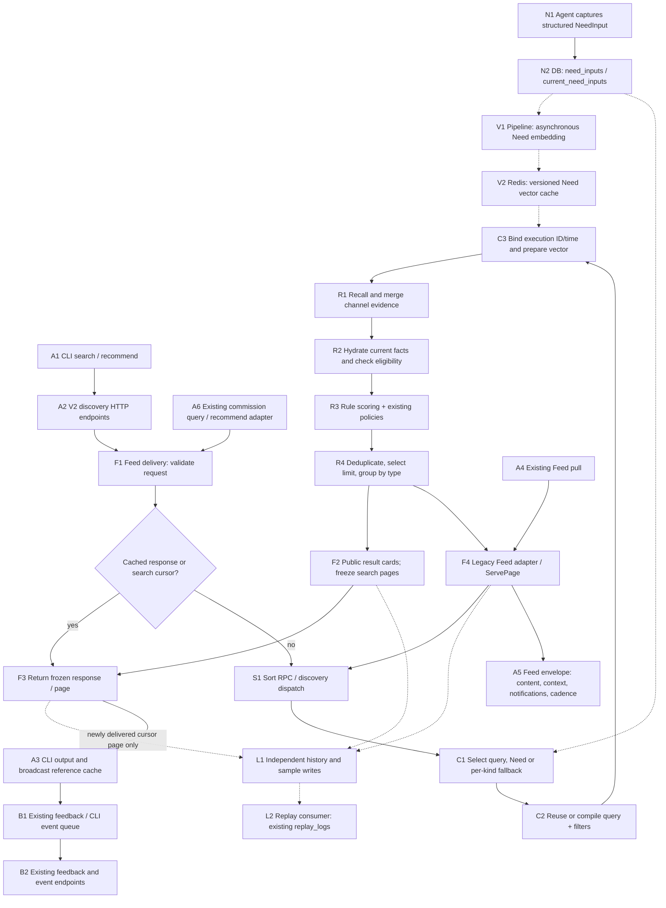
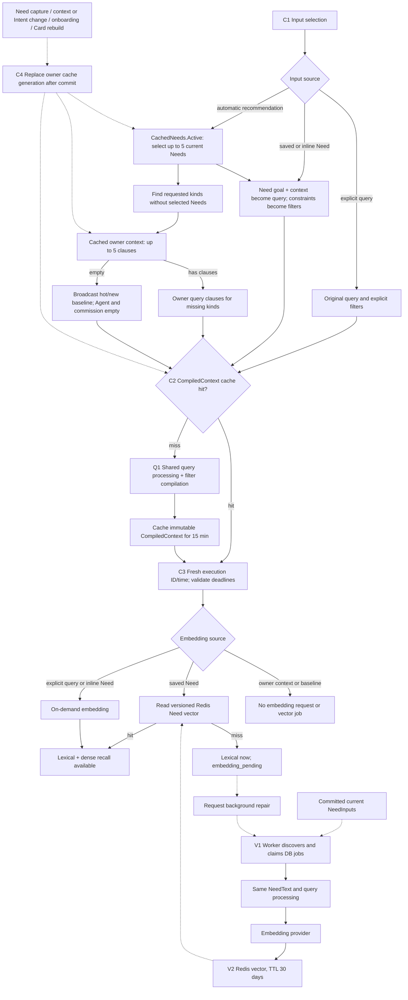
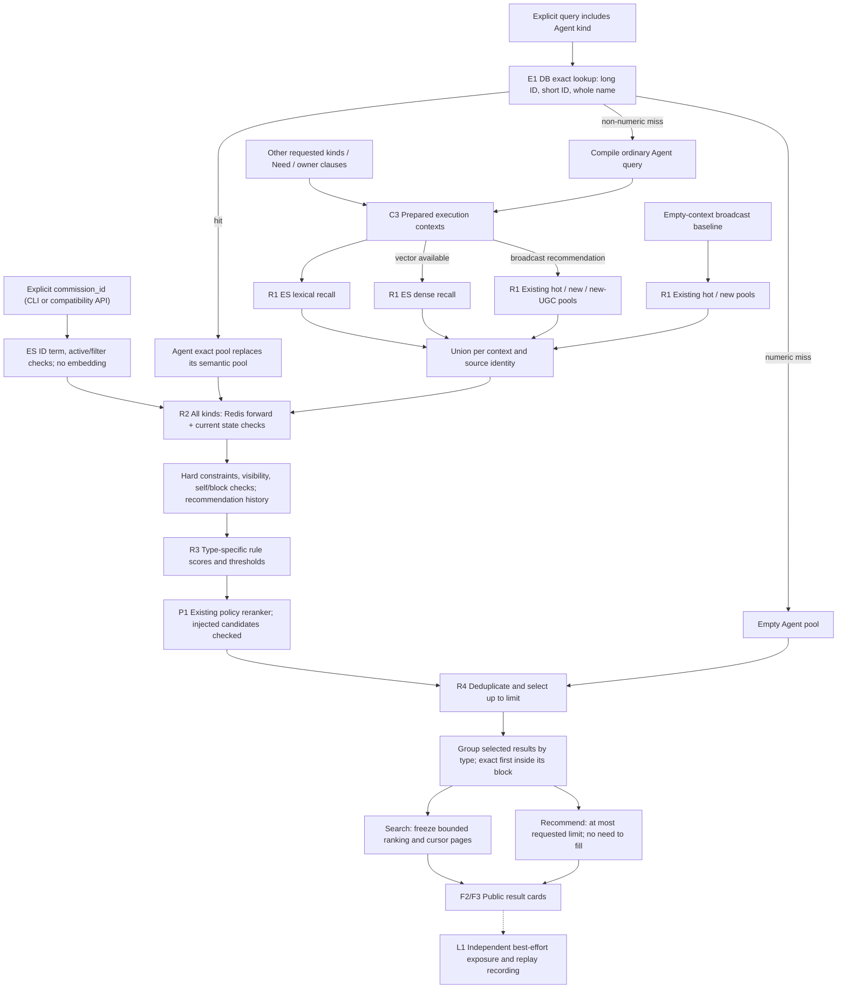

# Discovery workflow and code review index

This map describes `codex/need-search-mvp` including the registered forward feature module
(2026-09-28). It includes Need capture, online search/recommendation, the caches
and projections they consume, delivery and existing feedback. Model training
and the broader offline processing pipeline are outside this map.

Node IDs refer to the code index below. Solid arrows are request/data flow;
dotted arrows are asynchronous work or supporting data dependencies.

## 1. End-to-end service flow

`ENABLE_NEED_SEARCH` controls the new engine. Unified HTTP routes additionally
require `ENABLE_CONSOLE_V2`. The existing Feed path requests broadcast results;
the unified discovery path supports broadcast, commission and Agent results.
Legacy commission query/recommendation adapters also use the engine when enabled;
explicit commission-ID lookup also uses the new engine while preserving the compatibility HTTP contract.

The diagram's cache shortcut combines two different operations: an idempotent
response hit returns directly; a cursor hit selects a frozen page and schedules
recording only on its first delivery. Neither reruns Sort. Legacy Feed delivery
has its own page adapter and assembles broadcast details through Item RPC.

## 2. Input selection, compilation, caches and embeddings

All text inputs use the shared processor. A compiled cache hit reuses its already
processed result; it does not repeat processing. Baseline has no retrieval text.
Original Need JSON and provenance survive compilation; there is no
`NormalizedNeed`, taxonomy, vocabulary expansion or inferred hard constraint.
Open-ended requirements do not make an otherwise executable Need undeliverable.
Legacy unresolved structured constraints can still make that particular Need
unverified; they do not abort unrelated kinds.

Owner fallback extracts `watch_for` plus `trigger_when` from current
`intent_actions`; otherwise it uses Card seeking/demands/current focus/positive
interests. This is bounded text compilation, not behavior-history analysis or
semantic execution of `when` and `action`. Selected Needs cover their kinds even
when they later return no results: fallback does not bypass their constraints.
Explicit Need selection does not add automatic fallback.

| Cached value | Location / validity | Miss behavior |
| --- | --- | --- |
| Automatic Need selection | Redis, 30 seconds; empty 5 seconds; capped by earliest selected deadline | Read current NeedInput eligibility from DB |
| Owner context | Redis, 30 seconds; empty clauses 5 seconds | Read active context revision and Agent Card |
| CompiledContext | Redis, 15 minutes; owner generation + source/revision + options/compiler/query versions | Pure compilation; each reader receives a private copy |
| Saved Need vector | Redis, processed-text hash + embedding profile + query-processing version; 30 days | Continue lexically and schedule background repair |
| Frozen search result / optional idempotent response | Feed Redis, 24 hours | New first-page execution; expired cursors must restart |

The first three caches use process-local singleflight to deduplicate concurrent
fills; **there is no process-local L1 value cache**. Redis failure bypasses these
optional context caches and reads their source. Source errors still propagate.
Generation invalidation fences off old in-flight fills; missed invalidation is
bounded by input TTL. Explicit Need ownership/currentness and inline Intent
checks stay authoritative. Required delivery snapshot/cache errors are not
silently treated as optional context-cache misses.

`CompiledContext` contains no execution ID, request clock, vector or runtime
warning. Each execution attaches those separately. Online execution does not
insert into `discovery_contexts`; historical rows only retain expiry cleanup.

## 3. Recall, ranking and delivery semantics

Exact Agent resolution precedes ordinary query compilation. Agent-only exact
hits need neither ES nor embedding; other requested kinds keep their own
retrieval path. Exact hits still undergo visibility and hard filters. A mixed
search does not move Agent results ahead of another type's block.

Retrieval runs with at most six concurrent channel calls. Search freezes at most
200 ranked candidates, defaults to 20 per page and accepts up to 50. It selects
across kinds round-robin, then groups each page in requested kind order.
Recommendation defaults to 20 and accepts up to 100; selected Need results take
precedence over fallback when filling the total limit. Empty kinds add no
placeholder; all kinds may be empty with a successful response. Existing Feed
still assembles the rest of its envelope.

Rule scores use `lex = BM25 / (BM25 + scale)`. With valid semantic evidence,
`relevance = 0.55 * lex + 0.45 * normalized_cosine`; otherwise relevance is lexical.
Agent/commission semantic evidence comes from version-matched ES kNN scores
(`cosine = 2 * score - 1`), not Redis vectors. Broadcast also uses ES dense-score evidence; candidate vectors are not
loaded after recall. Relevance and final-score thresholds are configured
per type and mode.

| Type / path | Rule score before policies |
| --- | --- |
| Broadcast | `0.85 * relevance + 0.10 * freshness + 0.05 * quality` |
| Commission | `0.85 * relevance + 0.10 * fulfillment + 0.05 * budget_slack` |
| Agent | `0.90 * relevance + 0.10 * activity_freshness` |
| Exact Commission | Explicit `commission_id`, ES term lookup, Redis forward hydration and identity score 1; hard filters retained |
| Exact Agent | Identity score 1; semantic/activity threshold bypass, hard filters retained |
| Broadcast baseline | `0.80 * freshness + 0.20 * quality`; no query-relevance threshold |

There is no learned rank model in this path. Policy reuse does not imply reuse
of the legacy trained scorer. There is no final Sort `Revalidate` round trip.
Search cursor pages reuse frozen details and scores; a fresh request observes
current source state.

History and replay writes are independent background operations, not one atomic
transaction with the response cache. Search exposure history is separate from
recommendation deduplication history. Samples reuse `replay_logs` with
`pipeline_version=need_search_v1`, `sample_schema_version=2`, typed source IDs,
Need/Intent provenance, execution contexts and score evidence. Public cards carry
match types and rule metadata, not private Need text or numeric ranking features.
Existing broadcast feedback/event contracts remain in use; Agent and commission
IDs are never passed off as broadcast `item_id` values.

## 4. Supporting candidate projections

These are data dependencies of online retrieval, not extra synchronous steps
inside every search request.

| Candidate | Production / update path | Online retrieval | Online facts and ranking evidence |
| --- | --- | --- | --- |
| Broadcast | Existing item consumer and item index writer | Existing ES text/vector index and Redis recall pools | Registered Redis item view; bounded DB repair; current state checks |
| Agent | Card rebuild consumer → Agent projector → embedding and fenced index writes | ES searchable text, filter fields, vector, identity/version metadata; exact identity from DB | Redis forward Card facts without embedding or long text; current DB identity/account/relationship checks; dense score from ES |
| Commission | Catalogue events → commission index consumer → embedding and versioned projection; statistics events update forward statistics | ES searchable text, filter fields, vector, identity/version metadata | Redis forward catalogue/statistics without embedding or long text; current account/relationship checks; dense score from ES |

Forward views do not store source text or previews. Broadcast content hashes
bind ES evidence to current features. Exclusions use version-matched recall text
and preserve Chinese/English matching semantics; text is discarded before
scoring. ES summaries/titles and current Agent names provide frozen response
previews. ID-only broadcast pools batch-load DB summaries and load full content
only for exclusions in [source_text.go](../../../rpc/sort/discovery/source_text.go).
Existing Feed detail assembly still fetches selected item details by ID.

## 5. Code review index

Paths are relative to the repository through clickable links. Symbols are
provided instead of line numbers so the index survives routine edits.

### Entry points and delivery

| Node | Files / symbols | Review purpose |
| --- | --- | --- |
| A1 / A3 | [cli/cmd/discovery.go](../../../cli/cmd/discovery.go), `newDiscoveryCommands`, `discoveryCall` | User-facing search/recommend, pagination flags and output; Need IDs are not CLI arguments |
| A2 | [api/consolev2/discovery_handlers.go](../../../api/consolev2/discovery_handlers.go), `RegisterDiscovery` | Authentication, strict body decoding, commission access and Feed RPC |
| F1 | [rpc/feed/discovery.go](../../../rpc/feed/discovery.go), `Discovery`, `sortExecutor.Execute`; [delivery/service.go](../../../rpc/feed/delivery/service.go), `Serve` | Delivery orchestration and optional idempotent response cache |
| F2 / F3 | [delivery/search.go](../../../rpc/feed/delivery/search.go), `freezeSearch`, `loadSearch`, `page`; [discovery/types.go](../../../rpc/sort/discovery/types.go), `PublicItem`, `PublicResponse` | Frozen cursor pages and public card contract |
| A4 / F4 | [rpc/feed/handler.go](../../../rpc/feed/handler.go); [discovery_legacy.go](../../../rpc/feed/discovery_legacy.go), `fetchDiscoveryFeed`; [delivery/page.go](../../../rpc/feed/delivery/page.go), `ServePage` | Existing Feed routing and Item RPC page assembly |
| A5 | [api/consolev2/feed_handlers.go](../../../api/consolev2/feed_handlers.go), `pullFeedV2`, `buildFeedPayloads`, `matchFeedIntents` | Feed control context, notifications/cadence, payload budget and existing Intent attribution |
| S1 | [rpc/sort/handler.go](../../../rpc/sort/handler.go), `Discovery`; [discovery/service.go](../../../rpc/sort/discovery/service.go), `Run`; [wiring.go](../../../rpc/sort/wiring.go) | RPC boundary, operation dispatch, rollout/config and shared dependency assembly |
| A6 / Compatibility | [api/commissiondiscovery/handlers.go](../../../api/commissiondiscovery/handlers.go), [discovery.go](../../../api/commissiondiscovery/discovery.go); [rpc/sort/legacy/commission.go](../../../rpc/sort/legacy/commission.go) | Existing commission HTTP adapter to Feed discovery for text and explicit-ID search; legacy backend when the switch is off |

### Need, context and vector preparation

| Node | Files / symbols | Review purpose |
| --- | --- | --- |
| N1 | [api/consolev2/need_handlers.go](../../../api/consolev2/need_handlers.go); [pkg/need/contract.go](../../../pkg/need/contract.go); [needs skill reference](../../../skills/ef-broadcast/references/needs.md) | Agent-filled structure, capture and pending Intent review workflow |
| N2 | [pkg/need/store.go](../../../pkg/need/store.go), `Create`; [review.go](../../../pkg/need/review.go); [reader.go](../../../pkg/need/reader.go), `Current`, `Active`, `CheckIntent` | Durable inputs, capture completion, current lifecycle/version eligibility |
| C1 | [discovery/engine.go](../../../rpc/sort/discovery/engine.go), `contexts`; [input_cache.go](../../../rpc/sort/discovery/input_cache.go), `CachedNeeds.Active`, `Source.Owner`; [source.go](../../../rpc/sort/discovery/source.go), `loadOwner` | Per-kind Need coverage and owner/baseline fallback |
| C2 / C3 | [discovery/context.go](../../../rpc/sort/discovery/context.go), `CompiledContext`, `compiled`, `execution`; [compiler.go](../../../rpc/sort/discovery/compiler.go); [need.go](../../../rpc/sort/discovery/need.go); [intersect.go](../../../rpc/sort/discovery/intersect.go) | Immutable compilation, request binding, Need mapping, embedding selection and filter intersection |
| Q1 | [queryprocessing/processor.go](../../../rpc/sort/discovery/queryprocessing/processor.go), `NeedText`, `Process`; [queryprocessing README](../../../rpc/sort/discovery/queryprocessing/README.md) | Shared Unicode/script-aware query processing and exact identity protection |
| C4 | [pkg/cache/discovery.go](../../../pkg/cache/discovery.go) | Redis read-through, singleflight, generation invalidation and TTLs |
| C4 writers | [need_handlers.go](../../../api/consolev2/need_handlers.go), [control_handlers.go](../../../api/consolev2/control_handlers.go), [onboarding_handlers.go](../../../api/consolev2/onboarding_handlers.go), [pkg/agentcard/builder.go](../../../pkg/agentcard/builder.go) | Post-commit owner generation changes |
| V1 | [pipeline/consumer/need_embedding_worker.go](../../../pipeline/consumer/need_embedding_worker.go), `ProcessOne`; [needembedding/jobs.go](../../../rpc/sort/discovery/needembedding/jobs.go) | Durable job discovery, leasing, retry and shared query processing |
| V2 | [needembedding/cache.go](../../../rpc/sort/discovery/needembedding/cache.go), `Key`, `Lookup`, `Produce` | Vector identity/version, cache-only online reads, repair and production |
| Historical retention | [discovery/store.go](../../../rpc/sort/discovery/store.go), `Prune` | Historical Context cleanup only; absent from the online write path |

### Retrieval, ranking and projections

| Node | Files / symbols | Review purpose |
| --- | --- | --- |
| E1 | [discovery/source_query.go](../../../rpc/sort/discovery/source_query.go), `exactAgents` | Current long-ID, short-ID and whole-name equality lookup |
| R1 | [discovery/engine.go](../../../rpc/sort/discovery/engine.go), `Execute`; [source_query.go](../../../rpc/sort/discovery/source_query.go), `Query`, `search`; [source.go](../../../rpc/sort/discovery/source.go), `Recall` | Channel budgets, ES queries, recall pools, union and dense evidence version checks |
| R2 | [discovery/source.go](../../../rpc/sort/discovery/source.go), `Hydrate`, `Seen`; [filter.go](../../../rpc/sort/discovery/filter.go), `Check` | Candidate facts, current authority, hard constraints and exposure dedup |
| R3 / R4 | [discovery/score.go](../../../rpc/sort/discovery/score.go), `ScoreRules`, `Merge`, `groupResultPages` | Formulas, eligibility, total limit and exact-first type blocks |
| P1 | [legacy/discovery_policy.go](../../../rpc/sort/legacy/discovery_policy.go); [rerank/](../../../rpc/sort/rerank/) | Existing freshness, boost, injection and source-limit policies |
| Agent projection | [agentcard_consumer.go](../../../pipeline/consumer/agentcard_consumer.go); [pkg/featureindex/agent_search.go](../../../pkg/featureindex/agent_search.go), `AgentProjector.Project`; [agent_document.go](../../../pkg/featureindex/agent_document.go); [agent.go](../../../pkg/featureindex/agent.go) | Card search projection, ES-only candidate vector and Redis facts |
| Commission projection | [commission_index_consumer.go](../../../pipeline/consumer/commission_index_consumer.go); [pkg/featureindex/commission_search.go](../../../pkg/featureindex/commission_search.go); [commission_document.go](../../../pkg/featureindex/commission_document.go); [commission.go](../../../pkg/featureindex/commission.go) | Catalogue/search projection and separately updated statistics |
| Broadcast projection | [item_consumer.go](../../../pipeline/consumer/item_consumer.go); [rpc/sort/dal/es.go](../../../rpc/sort/dal/es.go) | Existing broadcast processing and ES mapping/index access |
| Feature registry / loaders | [Pipeline registration](../../../pipeline/feature_index.go); [index.go](../../../pkg/featureindex/index.go); [broadcast.go](../../../pkg/featureindex/broadcast.go); [feature contract](../../dev/feature_index.md) | Hot-reloaded YAML fields, batch reads/writes, fences, freshness and periodic source loading |
| Shared source schema | [discovery/index/](../../../rpc/sort/discovery/index/) | Normalization and remaining language/provider fields; no taxonomy |

### Recording, feedback and regression entry points

| Node / concern | Files / symbols | Review purpose |
| --- | --- | --- |
| L1 | [delivery/record.go](../../../rpc/feed/delivery/record.go), `recordAsync`, `sampleValues` | Separate history/sample writes, delivered positions, version markers and provenance |
| L2 | [replay_consumer.go](../../../pipeline/consumer/replay_consumer.go); [replay_dal.go](../../../pipeline/consumer/replay_dal.go) | Persist typed new-pipeline samples in existing replay table |
| B1 | [cli/cmd/feed.go](../../../cli/cmd/feed.go); [cli/internal/feedevent/](../../../cli/internal/feedevent/) | Existing feedback commands, local event ledger/queue and flush |
| B2 | [api_service.go](../../../api/handler_gen/eigenflux/api/api_service.go), `BatchFeedback`, `PushFeedEvents`; [item_stats_consumer.go](../../../pipeline/consumer/item_stats_consumer.go) | Existing event validation, publishing and feedback statistics |
| Context/cache tests | [context_cache_test.go](../../../rpc/sort/discovery/context_cache_test.go); [tests/discoverye2e/context_cache_test.go](../../../tests/discoverye2e/context_cache_test.go) | Cache isolation, freshness, invalidation and real service behavior |
| Input/vector tests | [tests/needs/](../../../tests/needs/); [need_embedding_test.go](../../../rpc/sort/discovery/need_embedding_test.go); [fallback_test.go](../../../rpc/sort/discovery/fallback_test.go) | Capture lifecycle, cache-only saved Need vectors and per-kind fallback |
| Ranking/delivery tests | [score_evidence_test.go](../../../rpc/sort/discovery/score_evidence_test.go); [source_query_test.go](../../../rpc/sort/discovery/source_query_test.go); [delivery/search_test.go](../../../rpc/feed/delivery/search_test.go); [delivery/service_test.go](../../../rpc/feed/delivery/service_test.go) | Semantic evidence, exact lookup, pagination and recording behavior |
| Full service/CLI tests | [tests/discoverye2e/README.md](../../../tests/discoverye2e/README.md); [discovery_test.go](../../../tests/discoverye2e/discovery_test.go); [cli_test.go](../../../tests/discoverye2e/cli_test.go) | End-to-end scenarios and execution instructions |

Recommended review order: `wiring.go` → `delivery/service.go` → `engine.go` →
`input_cache.go` / `context.go` / `compiler.go` → `source_query.go` / `source.go` →
`filter.go` / `score.go` → `discovery_policy.go` → `delivery/search.go` /
`delivery/record.go`. Follow the producer and feedback rows when auditing storage
or cross-service contracts. The detailed operational contract is in
[docs/dev/discovery.md](../../dev/discovery.md).

### Feature performance and monitoring

`featureindex.Prefetch` combines all type/generation components in one Redis
pipeline. `Engine.Execute` scopes a bounded cache to the request so Need contexts
reuse feature payloads, while scoring/filter evidence remains context-specific.
[codec.go](../../../pkg/featureindex/codec.go) performs direct typed decoding and
YAML masking. [loader.go](../../../pkg/featureindex/loader.go) owns paced active
scans; [audit.go](../../../pkg/featureindex/audit.go) adopts physical expiry on
legacy keys and publishes completed key counts by type. [metrics/feature_index.go](../../../pkg/metrics/feature_index.go)
exports operational metrics. Current YAML uses event/periodic freshness, 48-hour
broadcast retention and 7-day Agent/commission retention.
