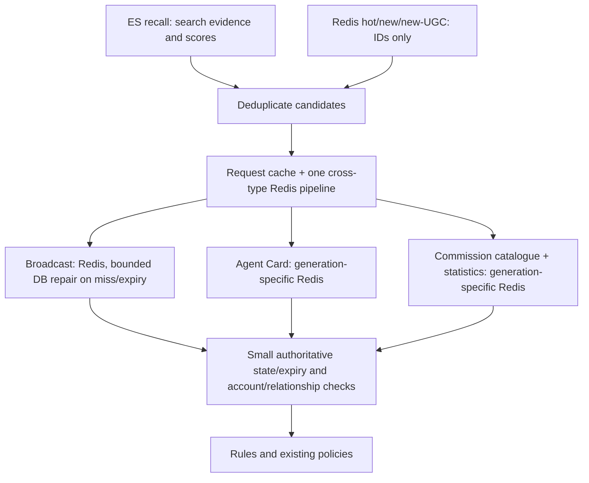

# Online feature index

`pkg/featureindex` owns the registered Redis forward views, field allowlists,
version-protected writes, bounded reads and periodic materialization lifecycle.
It is a local module shared by producers and Sort, not a new RPC service.
The Agent, broadcast and commission implementations live in this same package,
alongside their authoritative source adapters and typed builders.
Elasticsearch mappings and indexed documents are unchanged by this feature.

## Common interface and implementation layout

[Index[T]](../../pkg/featureindex/index.go) provides typed `Read`, `Write` and `WriteBatch`
methods plus the common `Materializer` lifecycle (`View`, `Generation`,
`LoadPage`). `AgentIndex`, `BroadcastIndex` and `CommissionIndex` implement it.
The scheduler accepts `Materializer` instances directly and owns retries,
leases and checkpoints without a switch on content type. The generic document
parameter preserves compile-time type checking instead of casting `any` values.

- `agent.go`: public Card feature reads/writes and DB page loading.
- `broadcast.go`: item feature reads/writes, DB repair and page loading.
- `commission.go`: composed catalogue/statistics reads/writes and RPC page loading.
- `*_document.go`: typed source snapshots and builders.
- `agent_search.go` and `commission_search.go`: ES projection/search behavior.
  These use the typed forward implementations when materializing Redis; ES
  mappings and query semantics are independent of the forward `Index` contract.
- `config.go`, `registry.go`, `store.go`, `loader.go`: shared infrastructure.

To add a forward-index type, implement `Index[NewDocument]` here, add its YAML
view(s), and register the instance with `Loaders`. The storage and scheduler do
not require type-specific changes. New search/recommendation result types still
need their own retrieval and response integration.

Read-miss behavior is explicit: broadcasts repair from DB; Agent/commission
return only available projections. Commission exposes `WriteStatistics` for
independent statistics events in addition to the common full-snapshot `Write`.
Neither `Read`, `Write` nor `LoadPage` calls an embedding model or fetches ES.

## Registered views

Field registration lives in four external YAML files under
[configs/featureindex](../../configs/featureindex/): `broadcast.item.yaml`,
`agent.card.yaml`, `commission.catalogue.yaml`, and `commission.statistics.yaml`.
Each file declares identity, ID/version fields, logical freshness (`ttl`), physical
retention (`retention_ttl`), optional loader pacing and a readable field list.
The writer persists only registered fields; batch reads also project the current
allowlist, including when Redis still contains an older payload. Embeddings are
prohibited. `Definitions()` returns private copies of the active snapshot.

Services use `FEATURE_INDEX_CONFIG_DIR` (default `configs/featureindex`, relative
to the working directory) and `FEATURE_INDEX_RELOAD_INTERVAL` (default `5s`).
Sort, Pipeline and Pipeline Cron load the external files before serving when
feature consumers are enabled. Discovery/Commission backfill tools and the API Commission diagnostics mode also
load and watch the same configuration. Missing/invalid startup files fail startup;
an invalid later update logs an error and retains the entire last good snapshot.
All files are strictly parsed and validated before one atomic in-process swap.
Duplicate views/fields, unknown YAML keys, missing ID/version fields, negative
TTLs, embeddings, and runtime changes to view identities are rejected.

After deploying hot-reload support once, changing a registered field or TTL
requires only configuration distribution, without rebuilding or restarting the
binaries. Mount/synchronize the same directory to all reader/writer instances;
this module watches local files and does not itself distribute configuration.
Use atomic file replacement, or switch a directory symlink to a complete revision
for coordinated multi-file updates. Each process logs the accepted SHA-256 digest
so configuration convergence can be checked; changes are not globally atomic.
The bundled YAML is only the library default, not a fallback for missing external
service configuration.

To add a field, append its existing source JSON name to the relevant `fields`
list. Generic `Forward.Put`/`Get` pick it up on the next reload. Source writes or
periodic loading populate existing entities progressively; this does not trigger
an immediate full backfill. Removed fields are hidden by reads immediately and
removed from stored payloads on subsequent writes. TTL changes apply to future
writes. Retain fields required by existing typed consumers and scoring rules.

This config selects fields already emitted by source adapters; it cannot create
a DB/RPC attribute, derive a new feature, or make typed ranking code consume an
unknown field. Those source/consumer changes still require code. In particular,
adding a name absent from a producer payload leaves it absent; it does not
manufacture a zero-valued feature.

| View | Source and writer | Version / freshness |
| --- | --- | --- |
| `broadcast.item` | `pkg/featureindex/broadcast.go`: raw/processed item DB join | Fence allocated before source read; event/periodic refresh; 48-hour physical retention |
| `agent.card` | `pkg/featureindex/agent.go`: public Agent Card projection | Existing Card rebuild fence; event/periodic refresh; 7-day physical retention |
| `commission.catalogue` | `pkg/featureindex/commission.go`: Commission source RPC | Existing catalogue version; event/periodic refresh; 7-day physical retention |
| `commission.statistics` | `pkg/featureindex/commission.go`: Order statistics RPC | Independent statistics version; event/periodic refresh; 7-day physical retention |

Forward views contain no content, summary, public descriptions, search text,
display names, commission titles/specifications or tags. They retain IDs,
versions, state, language/provider evidence, timestamps, expiry, quality,
prices/delivery limits and statistics. Broadcast also retains group/URL for
existing exposure deduplication, type enums, and a fixed 64-character
`content_hash` binding searchable content and filter evidence. Request-specific BM25, dense scores and
recall-channel attribution are not stored in forward views.

Keys retain `discovery:forward:<entity>:<generation>:<id>:<component>`.
Agent/commission generations are concrete ES index names; broadcast uses `v1`
because its source projection is independent of the existing rolling ES indices.
The decimal-string version comparison preserves int64 precision. Old writes
cannot replace a newer snapshot/tombstone while the key exists. Accepted writes
set physical retention atomically with the value; rejected stale writes do not
extend it. Version fences expire with their keys. Event consumers reload current
source snapshots; retention must cover the intended replay/recovery window.

`ttl` controls optional logical freshness through `expires_at`; zero means no
age-based read rejection. All bundled views use zero because incremental writers
and periodic repair refresh their scalar facts. Broadcast no longer forces a DB
reload every five minutes. Current DB visibility/expiry checks remain in place.
`retention_ttl` controls physical Redis expiry: broadcast 48 hours, other views
7 days. It must be zero or at least 1 ms, and cannot be shorter than nonzero
freshness. Zero retention is supported for compatibility but is not the default.
Retiring entities stop receiving periodic refresh and naturally expire; old
index generations also expire after their writers stop.

Missing Agent/commission projections still skip candidates rather than issue
online source RPCs. The interval between completed source scans must remain comfortably below their
retention; increase repair throughput if that condition stops holding. Older
keys without `expires_at` remain readable. No ES field change or reindex is needed.

## Read path



`Engine.Execute` creates a fresh request cache, shared across its Need contexts.
`Source.Hydrate` prefetches all type/generation components in one Redis pipeline;
Commission catalogue and statistics retain independent versions. Repeated
lookups reuse the same raw feature snapshot; decoding still returns owned typed
values per caller. Cache keys include Redis client, generation, component, ID
and immutable YAML snapshot identity. Errors are not cached. Source repair
invalidates request-local misses before rereading the accepted write fence.
The cache is bounded to 4,096 entries and 4 MiB of payload, plus bounded map/key
metadata. It contains no query scores or relationship decisions, and is discarded
with the execution. There is no cross-request L1 or full-index in-process copy.

Typed readers decode JSON once and clear fields outside the captured YAML
allowlist using a cached field plan. Writers select fields before encoding, so
unused source text is not serialized. The Redis Hash/JSON format is unchanged;
legacy generic `Forward.Get` still returns allowlisted JSON. Plans belong to the
configuration snapshot and are reclaimed after its users release it.

`Forward.Get` pipelines up to 1,000 IDs per component. Missing keys are distinct
from Redis errors. Broadcast batches missing/expired IDs into one DB source
read and fills the registered view; source failures propagate. Missing DB rows
materialize inactive tombstones. Warm feature reads do not reload content or ranking
attributes from DB. Active pre-upgrade broadcasts without `content_hash` are
repaired through the same bounded source loader. Agent/commission missing or version-incompatible projections
continue to skip candidates, without per-request source RPC calls. Exact Agent
identity lookup retains its existing DB path.

Broadcast status and expiry are checked in a small DB batch during hydration;
a warm feature snapshot cannot bypass a newly failed/deleted/expired item.
Author visibility and relationship checks retain their existing DB authority.
No additional return-time Revalidate is introduced.

Broadcast ES recall transfers existing ID, author, text/summary and language/slot
fields to compute a search-evidence fingerprint and reuse the summary preview,
plus the channel score.
It does not transfer embeddings, quality, grouping or timestamp features. The
fingerprint binds scores to searchable content/filter evidence; scalar feature
updates do not require an ES rewrite. Existing ES fields remain available for
legacy consumers. Hot/new candidates need no ES item fetch at all.

Text needed for `ExcludeTerms` is request-local evidence, not a ranking feature.
Agent/commission ES recall requests `search_text` only when exclusions exist;
commission recall also requests its title for presentation. Exact Agent lookup
uses the public Card, and previews use current DB identity names. After the
source version is checked, the existing Chinese substring / Latin word-boundary
evaluator applies exclusions. Full text is cleared before scoring and excluded
from the serialized candidate, search snapshots and sample records.

ID-only broadcast pools load summaries in a bounded DB batch after candidate
union. Only pools with exclusions additionally read original content and
validate its hash against the forward snapshot. They do not fetch ES features.
This presentation read applies to the bounded candidate set, including search
prefetch where applicable; previews remain frozen in existing pagination and
response caches. Final Feed detail assembly retains its existing by-ID reads.

Old Redis payloads lose retired fields on the next source write. To reclaim
space also for inactive rows, upgrade all readers/writers and run the existing
`go run ./scripts/discovery_forward_cleanup` (preview), then the same command
with `--apply`. It covers all three text-bearing components, derives broadcast
hashes before dropping text, preserves expiry/version fences, and skips values
changed concurrently. It never changes ES, statistics or Need vector caches.

All three kinds use dense recall score evidence (`cosine = 2 * score - 1`) rather
than candidate vectors in Sort. Lexical/pool-only candidates have no semantic
score unless also found by dense recall. Broadcast rule samples use the
configured rule version plus `:broadcast_dense_v1`; baseline scoring is unchanged.
This changes the evidence available to lexical/pool-only broadcast candidates.

## Materialization lifecycle

- Incremental Agent and commission writers call the same registered store.
  Catalogue and statistics retain independent version fences.
- Completed broadcast processing attempts a DB-to-forward refresh. A failed
  derived write is logged; the committed item does not re-enter LLM/dedup
  processing. Periodic loading and bounded read-through repair recover it.
- Pipeline registers source loaders through `pipeline/feature_index.go`.
  Commission refresh follows `ENABLE_COMMISSION_INDEX`, including legacy routing
  and rollback; broadcast and Agent refresh follow `ENABLE_NEED_SEARCH`. YAML `load` settings default to 100 rows per page,
  a 20-second timeout, a 1-second pause after a successful page, and a 5-minute
  pause after a completed scan. Settings are reread at the next scheduling
  iteration; an already-persisted next-due time remains effective until it passes.
- Broadcast scans completed item IDs and skips expired/invalid-expiry rows before
  loading content for hashes. Agent scans active, profile-ready public Cards and
  selects only language/activity fields from their JSON; commission scans active
  catalogue snapshots and loads statistics
  in a batch. Its scalar loader does not build search text from the RPC payload.
  One commission job materializes both registered components.
  Commission offline tombstones continue to arrive through the existing event
  consumer; an active-only scan is not a substitute for that event contract.
- `featureindex.Loaders` owns distributed leases, cancellation, persisted
  per-view/generation cursors, retry and error logging. A page advances only after
  all required writes succeed. Lease loss prevents checkpoint advancement.
  Repeated writes are version-protected; failed pages are safe to retry. A shared
  next-due checkpoint prevents replicas from bypassing page/cycle pacing.
  Failures use bounded exponential retry delays (2 to 32 seconds).
- Page writes use `WriteBatch` with up to 2,000 independently fenced mutations.
  The entire batch is validated before issuing commands. Missing Lua scripts
  retry only affected commands; Redis errors remain explicit. A page advances
  only after every required component write succeeds.
- A completed scan restarts from the beginning. Full-pass time grows with entity
  count and source latency; it is a repair path, not the incremental
  freshness SLA. Broadcast cold reads provide bounded immediate repair.
  Source loaders neither call embedding nor read/write ES.

A separate leased census scans Redis with a COUNT hint of 1,000, at most one
page per second across replicas, under a 20-second page deadline. It pauses for
five minutes after a complete pass. The census also adds physical TTL only to
registered legacy keys without TTL (`PEXPIRE NX`), including retired generations;
existing TTLs, version fences and values are untouched. It reads PTTL rather
than payloads or per-key memory usage. Cursor and per-view counts are checkpointed
together under the lease, allowing another replica to resume without counting a
committed page again. Intermediate state is O(registered views).

## Monitoring

The primary metrics are **physical key count by type** and **Redis miss rate by
type**. Metrics are registered in `pkg/metrics/feature_index.go`; Sort exports
read outcomes and Pipeline publishes key counts on their existing `/metrics`
endpoints. There are no FeatureIndex latency, batch-size, payload-size, or
per-key memory histograms.

| Metric | Meaning |
| --- | --- |
| `feature_index_keys{type,view}` | Physical feature keys observed in the last completed census |
| `feature_index_key_scan_completed_timestamp_seconds` | Completion time of the shared published census; zero before the first completion |
| `feature_index_read_items_total{type,view,outcome}` | Redis `hit`, `miss`, `expired`, `error`, or request-cache `request_hit` |
| `feature_index_write_items_total{view,outcome}` | Stored, rejected stale, or failed component writes |
| `feature_index_loader_steps_total{view,outcome}` | Successful pages, failures, lease contention and shared schedule waits |
| `feature_index_loader_last_success_timestamp_seconds{view}` | Last successfully checkpointed source page |
| `feature_index_loader_last_cycle_timestamp_seconds{view}` | Last completed source scan |
| `feature_index_audit_total{outcome}` | Observed keys, adopted retention, completed census cycles and errors |

`type` is `broadcast`, `agent`, or `commission`. The four `view` values are
`broadcast.item`, `agent.card`, `commission.catalogue`, and
`commission.statistics`. No ID, query, or concrete generation is a label.

**Key count** includes all generations and tombstones until physical expiry;
it measures storage, not eligible entities. Commission typically occupies two
keys per entity (catalogue and statistics). Only complete scans replace the
published snapshot, including explicit zeroes for empty views. Before the first
complete scan, counts are absent rather than falsely reported as zero. Every
Pipeline replica reads the same persisted snapshot; deduplicate replicas with
`max`, never add their copies. A restarted process can export the last complete
snapshot immediately.

SCAN is not an atomic snapshot. Concurrent writes, expiry and keyspace rehashing
can change counts; Redis can also return duplicate keys across pages. The count
is a periodic observation, not a billing-grade exact census. Same-page duplicates
are removed; keeping a full in-memory set of every key is deliberately avoided.
Errors or lease loss keep the previous snapshot. Use its completion timestamp
to detect stale observations. A census scans the Redis DB incrementally, including
nonmatching keyspace; completion time depends on the total DB size.

**Miss rate** is `(miss + expired) / (hit + miss + expired)` over actual Redis
component lookups. Input IDs are deduplicated per component batch. Request-cache
reuse (including remembered misses) and Redis failures are excluded from both
numerator and denominator. Broadcast DB repair does not erase the preceding
Redis miss. Commission aggregates its two components, so this is a key lookup
miss rate, not the proportion of dropped commission candidates. Zero traffic
means no rate observation, not a guaranteed 0% miss rate.

PromQL examples below must be scoped to one deployment and Redis database:

```promql
# Physical key count by type. Deduplicate replicas, then add components.
sum by (type) (max by (type,view) (feature_index_keys))

# Separate catalogue and statistics storage.
max by (type,view) (feature_index_keys)

# Miss percentage by type; counters aggregate across Sort replicas.
100 *
sum by (type) (rate(feature_index_read_items_total{outcome=~"miss|expired"}[5m]))
/
sum by (type) (rate(feature_index_read_items_total{outcome=~"hit|miss|expired"}[5m]))

# Age of the latest complete key census.
time() - max(feature_index_key_scan_completed_timestamp_seconds)

# Source loader progress, retained as a lightweight health signal.
time() - max by (view) (feature_index_loader_last_success_timestamp_seconds)
```

Alert primarily on sustained miss-rate increases, unexpected key-count growth or
drops, and a stale census. Read/write errors and source-loader progress help
explain those changes. Redis exporter remains responsible for total memory,
fragmentation and evictions. Dashboard/alert deployment belongs to the separate
observability repository.

## Code and validation index

| File | Responsibility |
| --- | --- |
| [YAML files](../../configs/featureindex/), [config.go](../../pkg/featureindex/config.go) | Field registration, strict validation and atomic hot reload |
| [index.go](../../pkg/featureindex/index.go) | Common typed index and materialization contracts |
| [registry.go](../../pkg/featureindex/registry.go) | View lookup and field projection |
| [store.go](../../pkg/featureindex/store.go) | Keys, protected batch writes, cross-type read plans and source-read fences |
| [codec.go](../../pkg/featureindex/codec.go), [request.go](../../pkg/featureindex/request.go) | YAML field plans and bounded execution-local reuse |
| [audit.go](../../pkg/featureindex/audit.go) | Legacy retention adoption and resumable key census |
| [feature_index.go](../../pkg/metrics/feature_index.go) | Registered Prometheus producers |
| [loader.go](../../pkg/featureindex/loader.go) | Registered source-loader lifecycle and checkpoints |
| [broadcast.go](../../pkg/featureindex/broadcast.go) | Broadcast source adapter, read-through and page loader |
| [agent.go](../../pkg/featureindex/agent.go) | Typed Card adapter and periodic source load |
| [commission.go](../../pkg/featureindex/commission.go) | Typed independent components and batched source load |
| [discovery/source_text.go](../../rpc/sort/discovery/source_text.go) | Bounded pool preview and optional exclusion evidence from DB |
| [discovery/source.go](../../rpc/sort/discovery/source.go), [source_query.go](../../rpc/sort/discovery/source_query.go) | Online feature assembly and minimal recall responses |

Unit tests cover projection allowlists, missing/corrupt values, expiry, int64
version guards, stale tombstones, lease loss and failed-page retry. Integration
and process E2E cover real source loads, Redis-driven ranking quality, current
item state despite a warm cache, dense-score semantics and existing three-kind
serving. The hot/new unit regression runs with no ES client.

Configuration tests cover live field additions/removals, invalid snapshot retention,
atomic file replacement, cancellation and concurrent reads during reload. Process
E2E changes the running Sort reader configuration and verifies the changed field
in persisted ranking samples without restarting the service.

A shared generic contract suite verifies all three implementations through
`Index[T]`, including warm reads, stale writes, bounded source loads and common
scheduler registration.

Synthetic memory check on Redis 7.4.8 (same key shape, no replicas):

| Kind | Previous bytes at 4 KiB source text | Current bytes | Reduction |
| --- | ---: | ---: | ---: |
| Agent | 5,456 | 528 | 90.3% |
| Broadcast (plus 1 KiB summary) | 6,520 | 824 | 87.4% |
| Commission (both components) | 11,200 | 1,216 | 89.1% |

Current sizes were unchanged with 1, 4 and 12 KiB input text. These are synthetic
fixtures, not production averages; URL/slot sizes, Redis encoding, allocator and
replication overhead still affect actual capacity.

Actual Agent decode benchmark on Apple M4 Pro (three runs): typed decode takes
1.01–1.13 microseconds, 392 B and 6 allocations per document; the map/filter/JSON
round trip takes 3.42–3.58 microseconds, 2,384 B and 52 allocations. This measures
codec work, not end-to-end latency. Pipeline-hook tests verify one prefetch round
for all four components and no additional Redis reads across three reuse passes.
Tests verify key counts by type, zero counts after expiry, checkpoint fencing,
replica pacing and the miss-rate denominator. Real Redis tests verify retention adoption; process E2E scrapes the
running Sort metrics endpoint alongside search/recommendation regression tests.
