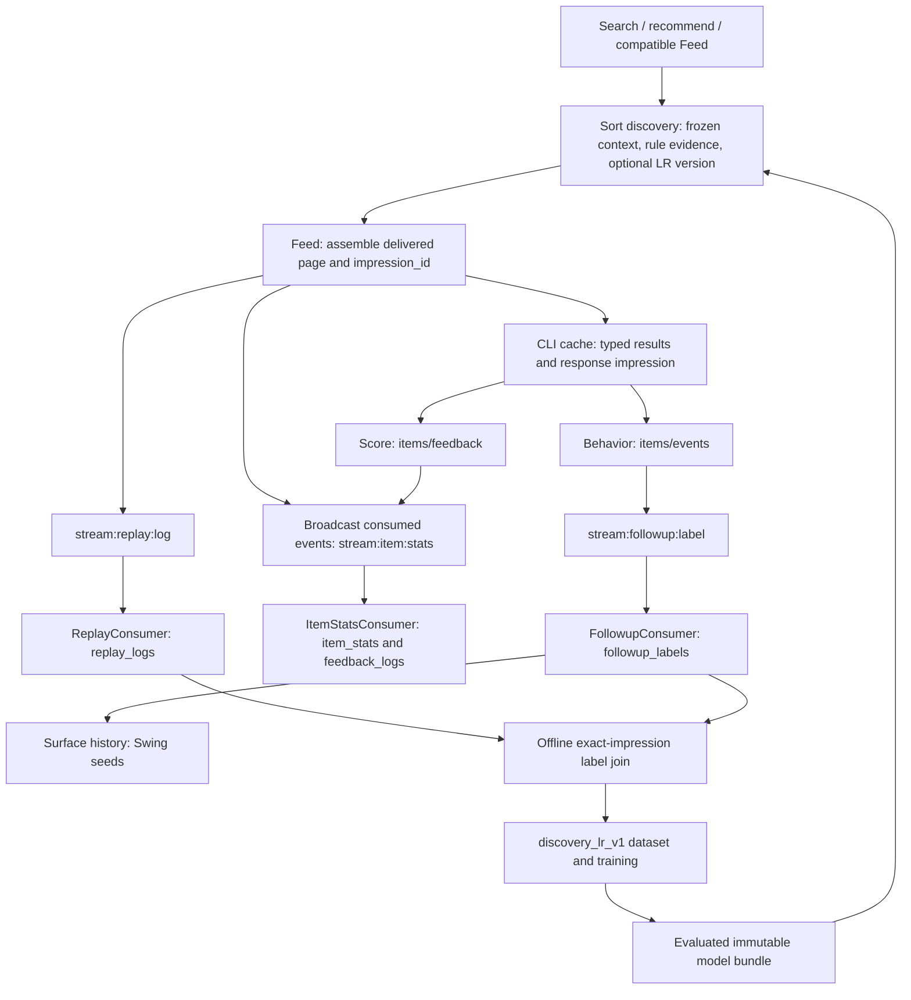

# Discovery attribution audit

Audit: 2026-10-04. Server baseline: `18c47160` (PR #359). Offline ETL baseline:
`eigenflux-rec-offline` main `8a6c7f3`. Production access was read-only, with
read-only PostgreSQL transactions and bounded query timeouts. No production
source, configuration, rows, queues or model assets were changed.

## Result

The new serving snapshots and exact-impression behavior joins work. Two producer
omissions prevented a complete feedback loop: CLI score submissions normally
omitted the exposure identifier, and discovery delivery omitted consumption
statistics events. This change fixes both prospectively. It does not repair
historical data or claim that best-effort delivery recording is lossless.

## Contracts and ownership



| Boundary | Identity and collection rule |
| --- | --- |
| Request/page → exposure | `impression_id` is opaque. Frozen pages retain it and use absolute positions. Retries reuse the response. Prefetched, rejected, missing-detail and empty results are not exposures. |
| Exposure storage | Unique `(impression_id, position)`; discovery rows carry `pipeline_version=need_search_v1`, schema 2, mode, context/Need identity and frozen candidate evidence. |
| Typed identities | `source_kind + source_id` identifies broadcast/Agent/Commission. Only broadcasts have `item_id`; numeric IDs alone cannot identify a kind. |
| Score feedback | `feedback_logs` is append-only. Its stream-message uniqueness and aggregate update share a transaction. Explicit per-item impression overrides the batch impression. Missing attribution does not prevent existing score collection. |
| Behavior feedback | `surface`, `question`, `discussion`, `task` enter `followup_labels`, deduplicated by `dedup_key`. CLI `event record --impression-id` validates against the exact cached item/exposure. Low-level push/API callers can still submit missing or mismatched IDs. |
| Offline join | Join all three of `(impression_id, agent_id, item_id)`, require delivered broadcasts, and require behavior time at/after exposure and at/before extraction cutoff. An impression contains multiple items: impression-only joins are wrong. |
| LR training | Only schema-2 `need_search_v1` broadcast **recommendations** enter `discovery_lr_v1`; explicit search, other kinds and legacy feature contracts remain separate. Labels come from `followup_labels`, not score feedback. Frozen rule features are inputs; model probability and later policy score are not fed back as inputs. |
| Other consumers | Surface labels update Swing seed history. Beat coverage/highlights restrict replay reads to broadcasts and Feed/recommendation modes. Their item-level feedback displays and PGC content-outcome views are not exact-exposure training joins. |
| Commission/Agent | New discovery snapshots retain their typed exposure identities. Commission order contracts have an optional impression field in the separate Commission service; the audited production window contains no orders, so conversion attribution has no live sample to validate. There is no broadcast-score/behavior contract for Agent or Commission IDs. |

Code: [delivery recording](../rpc/feed/delivery/record.go),
[replay ingestion](../pipeline/consumer/replay_consumer.go),
[score ingestion](../pipeline/consumer/item_stats_consumer.go),
[behavior ingestion](../pipeline/consumer/followup_consumer.go),
[CLI feedback](../cli/cmd/feed.go), [CLI ledger](../cli/internal/feedevent/ledger.go).
The offline query is `eigenflux-rec-offline/queries/discovery_lr_training_samples.sql`.

## Production evidence

Fixed window: **2026-10-02 14:07:00 through 2026-10-04 14:30:00 Asia/Shanghai**,
end exclusive. Counts below were read in one snapshot at 14:40:53. Delayed
arrivals can change results of later audits for the same event-time window.

| Mode | Kind | Delivered samples | LR metadata |
| --- | --- | ---: | ---: |
| Recommendation | Broadcast | 44,688 | 929 |
| Recommendation | Agent | 145 | 0 |
| Search | Broadcast | 1,130 | 0 |
| Search | Agent | 15,970 | 0 |
| Search | Commission | 3 | 0 |

All these rows had delivered=true and valid non-null context/source identity
and schema markers. Both observed LR model versions were present in frozen
candidate metadata: `lr_20261004_0437_1cf75cd7` and `lr_20261004_0511_1cf75cd7`.
There were no Commission recommendation samples in this window. A separate
read-only query of the production Order database found zero orders created in
the same window; no live conversion can establish the order-attribution link.

| Feedback kind | Total | Missing impression | Nonempty but unmatched | New recommendation | New search | Legacy |
| --- | ---: | ---: | ---: | ---: | ---: | ---: |
| Score | 17,751 | 17,593 | 0 | 158 | 0 | 0 |
| Surface | 2,819 | 20 | 7 | 2,730 | 20 | 42 |
| Question | 54 | 0 | 0 | 54 | 0 | 0 |
| Discussion | 338 | 0 | 6 | 328 | 0 | 4 |
| Task | 4 | 0 | 0 | 4 | 0 | 0 |

- **99.11% of score events lack an exposure ID.** The same pattern existed before
  cutover. CLI `feed feedback` forwarded scores without consulting the cache;
  server/stream/consumer already preserved supplied IDs. This is a proven missing
  enrichment path, not proof that every unattributed row came from that CLI.
- **33 of 3,215 behavior events cannot be exactly joined** (20 empty, 13
  mismatched/missing). Twelve mismatches are six surface and six discussion
  events from one actor at 14:11:54 on October 4. Their impression exists for the
  same actor, but contains different items; their actual items have other
  exposures. One further event has no corresponding actor/item exposure.
  These are not repaired by an impression-only or nearest-time join.
- There are **2,893 distinct labeled recommendation exposures** and **20 labeled
  search exposures**. Multiple event kinds on one item/exposure count once here.
  These are observed positives, not a mature-label quality or model-quality estimate.
- Of 15,565 distinct broadcasts with 45,818 exposures, **7,394 have zero/missing
  consumption counters**, covering **22,674 exposures**. This is a lower bound
  on the impact, since older nonzero counters can hide missing new increments.
- At inspection, all three consumer groups had **pending=0 and lag=0**. Available
  Feed/Pipeline journal lines since cutover contained no discovery recording or
  replay-insert failure match; four ItemStats failure lines existed. These
  observations do not prove historical losslessness and do not explain a
  producer that never emitted a consumption event.

## Fixes and verification

1. CLI score feedback now fills absent exposure IDs using the latest unexpired
   broadcast cache entry, preserves explicitly supplied IDs, and leaves unknown
   or expired items unattributed. Skill instructions require the originating
   ID per item, particularly across search/recommendation results and pages.
   Cache fallback cannot infer which repeated exposure caused a judgment.
2. Discovery emits existing consumption events for delivered broadcasts in both
   search and recommendation, independently of history/sample writes. Typed
   nonbroadcast results, skipped/prefetched candidates and cached response
   retries do not increment counters. Failure uses recording stage `consumed`.
3. Pipeline documentation now specifies the exact three-key join and removes
   the obsolete timestamp-proximity join guidance.

The core build, full CLI module tests, affected Feed/delivery/itemstats/consumer
unit tests, and three separately launched integration cases
(`TestDiscoveryCLIE2E`, `TestDiscoveryE2E`, `TestDiscoveryLRRecommendation`) pass.
The cases run in separate processes because the existing shared Redis client
cache retains a closed client when multiple stack-owning cases run together.

Regression tests reproduced both omissions before the fixes. Tests cover
explicit/implicit score attribution, repeated exposure selection, large string
IDs, unknown items, mixed result kinds, response retries, missing-detail pages
and independent recording failures. The real CLI integration test launches
HTTP/RPC services and production Replay, ItemStats and Followup consumers with
isolated PostgreSQL/Redis/etcd, then requires feedback and behavior to join the
persisted exposure and consumption counts to match delivered broadcasts.

## Operational limits and remaining work

- **Release required:** these fixes do not change running production. Merge and
  deploy the backend through the normal main deployment workflow, then release
  the CLI binary. The compatible Skill change can already carry explicit IDs
  through existing CLI versions; no new flag is required.
- **Historical repair:** score rows with missing IDs cannot be deterministically
  reconstructed from timestamps. Preserve them as unattributed. Consumption
  repair requires a bounded, idempotent reconciliation with a recorded cutoff
  and baseline; do not blindly add replay counts to cumulative counters. No
  repair SQL is executed or included here.
- **Validation/monitoring:** API acceptance is not evidence of a valid exposure
  association. Track empty and unmatched rates separately. Exact joins exclude
  bad labels, but accepted surface labels still feed Swing history. A future
  server-side validation/quarantine contract must account for asynchronous
  replay arrival and existing callers rather than silently rewriting IDs.
- **Durability:** history, consumption and sample publication remain best-effort
  independent writes with two-second deadlines. Response success and an empty
  pending queue cannot establish complete capture. A durable outbox/repair
  design would be separate work. Existing consumed-event retries are not made
  transactionally idempotent by this fix.
- **Replay scope:** `replay/pipeline.go` simulates the legacy formula pipeline.
  It does not execute the new discovery compiler/engine/LR model. New snapshots
  support feature/score/model attribution and training extraction, but do not
  retain all rejected candidates for a full counterfactual reranking. Do not
  describe a legacy simulator run as reproduction of new discovery serving.
- **Coverage boundary:** Commission order conversion (no production orders in the window), Agent-result engagement,
  externally scheduled ETL completion and retraining promotion were not proven
  end to end in production. Observed model-version snapshots demonstrate that
  evaluated bundles are serving, not that every future training run will succeed.

## Repeatable check

Use [the aggregate diagnostic SQL](../scripts/diagnostics/discovery_attribution.sql)
with an authorized read-only connection. Choose an end time at least two
minutes before inspection to reduce in-flight ingestion false positives:

```sh
psql "$PG_DSN" -X -v ON_ERROR_STOP=1 \
  -v since='2026-10-02 14:07:00+08' \
  -v until='2026-10-04 14:30:00+08' \
  -f scripts/diagnostics/discovery_attribution.sql
```

The script uses a read-only repeatable-read transaction, bounded statement and
lock timeouts, and prints aggregates without private content or actor IDs.
