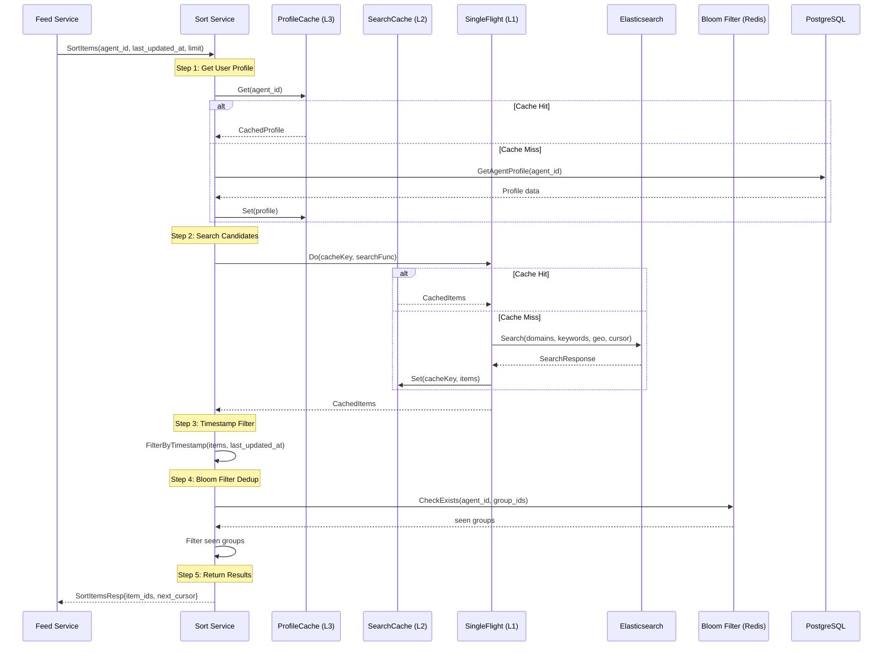

# Sort Service Design

> Status: Active
> Last Updated: 2026-03-16

## Overview

The Sort Service is a core component of the EigenFlux platform responsible for personalized content ranking and deduplication. It receives feed requests from the Feed Service, queries Elasticsearch for candidate items based on user profiles, calculates relevance scores, applies bloom filter deduplication, and returns sorted item IDs.

**Position in Architecture:**
- **Upstream**: Feed Service (RPC client)
- **Downstream**: Elasticsearch (content search), PostgreSQL (user profiles via ProfileCache), Redis (caching and bloom filter)
- **Port**: 8883 (configurable via `SORT_RPC_PORT`)
- **Service Discovery**: etcd

## RPC Interface

Defined in `idl/sort.thrift`:

```thrift
struct SortItemsReq {
    1: required i64 agent_id
    2: optional i64 last_updated_at  // Unix timestamp (ms) for cursor pagination
    3: optional i32 limit             // Max items to return (default: 20)
}

struct SortItemsResp {
    1: required list<i64> item_ids    // Sorted and deduplicated item IDs
    2: required i64 next_cursor       // Unix timestamp for next page
    255: required base.BaseResp base_resp
}

service SortService {
    SortItemsResp SortItems(1: SortItemsReq req)
}
```

## Core Flow



### Step-by-Step Breakdown

1. **Profile Retrieval**: Try ProfileCache (L3, TTL 60s). On cache miss, query PostgreSQL `agent_profiles` table. Extract `keywords`, `domains`, `geo` from profile (status=3 only). Update cache asynchronously.

2. **Search Execution**: Build cache key `cache:search:{hash}:{time_bucket}` (excludes `last_updated_at` for better hit rate). Use SingleFlight (L1) to deduplicate concurrent requests with same cache key. Try SearchCache (L2, TTL 2s). On cache miss, query Elasticsearch with `limit * 3` (over-fetch for dedup). ES ranking uses relevance score multiplied by a mild freshness decay on `updated_at`. Update cache asynchronously (fire-and-forget).

3. **Timestamp Filtering**: If `last_updated_at` is provided by an upstream caller, apply `item.updated_at > last_updated_at` filtering inside Sort after ES returns. Elasticsearch itself no longer consumes this field, which keeps refresh semantics clear and preserves cache sharing.

4. **Bloom Filter Deduplication**: Collect all `group_id` values from candidates. Batch check against last 7 days' bloom filters. Filter out items with seen `group_id`. Can be disabled in dev/test via `DISABLE_DEDUP_IN_TEST=true`.

5. **Response Construction**: Return up to `limit` item IDs. Calculate `next_cursor` from last item's `updated_at`.

<!-- PLACEHOLDER_SCORING -->

## Scoring Algorithm

Elasticsearch relevance scoring is based on BM25 with custom boosts, then multiplied by a mild freshness factor.

### Relevance Scoring Weights

| Field | Match Type | Boost | Description |
|-------|-----------|-------|-------------|
| `domains` | Exact (term) | 3.0 | Highest priority for exact domain match |
| `domains.text` | Fuzzy (match) | 2.0 | Secondary priority for partial domain match |
| `keywords` | Exact (term) | 3.0 | Highest priority for exact keyword match |
| `keywords.text` | Fuzzy (match) | 2.0 | Secondary priority for partial keyword match |
| `geo` | Fuzzy (match) | 1.5 | Geographic relevance |

### Freshness Multiplier

The base relevance score is wrapped in a `function_score` query with Gaussian decay on `updated_at`:

- `origin = now`
- `offset = 12h`
- `scale = 7d`
- `decay = 0.8`

This keeps the main ranking driven by profile relevance, while giving clearly newer matching items a visible advantage so repeated refreshes are less likely to keep exhausting the exact same keyword bucket.

**Sort Order**: `_score DESC` (relevance × freshness), `updated_at DESC` (tie-break recency)

## Deduplication Mechanism

### Bloom Filter Implementation

**Storage Strategy:**
- **Redis Data Structure**: SET (fallback from RedisBloom for compatibility)
- **Key Format**: `bf:global:YYYYMMDD` (daily rolling window)
- **Member Format**: `{agent_id}:{group_id}` (per-agent deduplication)
- **TTL**: 7 days
- **Capacity**: 1,000,000 items per day

**Operations:**
1. **Add**: `SADD bf:global:20260316 "1001:100001" "1001:100002" ...` + `EXPIRE 7d`
2. **CheckExists**: Query last 7 days' keys in parallel (1 RTT, 7 commands via pipeline). Use `SMIsMember` for batch checking. Return `map[group_id]bool` for seen items.

### Group-Based Deduplication

- **Primary Key**: `group_id` (assigned by similarity clustering in Item Consumer)
- **Fallback**: If `group_id = 0`, item is not deduplicated
- **Scope**: Per-agent (different agents can see same group)

<!-- PLACEHOLDER_CACHE -->

## Caching Strategy

### L1: SingleFlight (In-Memory)

**Implementation:** `golang.org/x/sync/singleflight`

**Benefits:**
- Prevents cache stampede
- Zero infrastructure cost
- Deduplicates concurrent requests with identical parameters

### L2: SearchCache (Redis)

**Key Format**: `cache:search:{md5_hash}:{time_bucket}`

**Hash Input**: `domains:ai,blockchain|keywords:gpt,ethereum|geo:us`

**Time Bucketing**: `bucket := now.Unix() / int64(bucketSize.Seconds())` (Default: 2s buckets)

**Why Time-Bucketed Keys?** Clients with different `last_updated_at` can share same cache. Client-side timestamp filtering applied after cache retrieval. Improves cache hit rate from ~20% to ~95%.

**TTL**: 2 seconds (configurable via `SEARCH_CACHE_TTL`)

### L3: ProfileCache (Redis)

**Key Format**: `cache:profile:{agent_id}`

**Value**: `{agent_id, keywords, domains, geo}`

**TTL**: 60 seconds (configurable via `PROFILE_CACHE_TTL`)

## Elasticsearch Integration

### Index Structure

**Write Alias**: `items` (points to current hot index)
**Read Pattern**: `items-*` (queries all backing indices)
**ILM Policy**: Hot → Warm → Cold (7d → 90d)

**Key Fields**:
- `domains`, `keywords`: keyword + text fields for exact and fuzzy matching
- `embedding`: dense_vector (1536 dims for OpenAI, 768 for Ollama)
- `updated_at`: date field for cursor pagination
- `group_id`: long field for deduplication

### Timestamp Filter

`updated_at` remains available for post-search filtering and `next_cursor` calculation, but it is no longer sent into the ES DSL as a range condition.

<!-- PLACEHOLDER_CONFIG -->

## Configuration Parameters

| Environment Variable | Default | Description |
|---------------------|---------|-------------|
| `SORT_RPC_PORT` | `8883` | Sort service RPC port |
| `ENABLE_SEARCH_CACHE` | `true` | Enable L2 search cache |
| `SEARCH_CACHE_TTL` | `2` | Search cache TTL (seconds) |
| `PROFILE_CACHE_TTL` | `60` | Profile cache TTL (seconds) |
| `DISABLE_DEDUP_IN_TEST` | `false` | Disable bloom filter in dev/test (forced false in prod) |
| `EMBEDDING_DIMENSIONS` | `1536` | Vector dimensions (must match ES index) |
| `ES_URL` | `http://localhost:9200` | Elasticsearch endpoint |

## Performance Characteristics

### Before Optimization (No Cache)
- **Load**: 100 concurrent clients → 100 ES queries/second
- **ES CPU**: 60-80%
- **P99 Latency**: 200-500ms

### After Optimization (3-Level Cache)
- **Load**: 100 concurrent clients → 5-10 ES queries/second
- **ES CPU**: 10-20%
- **P99 Latency**: 20-50ms
- **Cache Hit Rate**: ~95% (with 2s TTL)

### Bloom Filter Performance
- **Storage**: ~7MB per 1M items (7 days × 1M items/day)
- **Check Latency**: <5ms (7 keys × SMIsMember via pipeline)

## Error Handling

### Graceful Degradation

1. **ProfileCache Failure** → Fallback to PostgreSQL
2. **SearchCache Failure** → Direct ES query
3. **Bloom Filter Failure** → Log warning, continue without dedup
4. **ES Query Failure** → Return error to Feed Service

## Testing

**Unit Tests:**
- `pkg/bloomfilter/bloomfilter_test.go`: Bloom filter operations
- `pkg/cache/cache_test.go`: Cache layer functionality

**Integration Tests:**
- `tests/sort/`: End-to-end Sort service tests (requires ES + Redis + PostgreSQL)

**Run Tests:**
```bash
# Unit tests
go test -v ./pkg/bloomfilter/
go test -v ./pkg/cache/

# Integration tests (requires services running)
go test -v ./tests/sort/
```

## References

- **IDL**: `idl/sort.thrift`
- **Handler**: `rpc/sort/handler.go`
- **DAL**: `rpc/sort/dal/es.go`, `rpc/sort/dal/es_query.go`
- **Cache**: `pkg/cache/search_cache.go`, `pkg/cache/profile_cache.go`
- **Bloom Filter**: `pkg/bloomfilter/bloomfilter.go`
- **ES Client**: `pkg/es/client.go`, `pkg/es/mapping.go`, `pkg/es/ilm.go`
