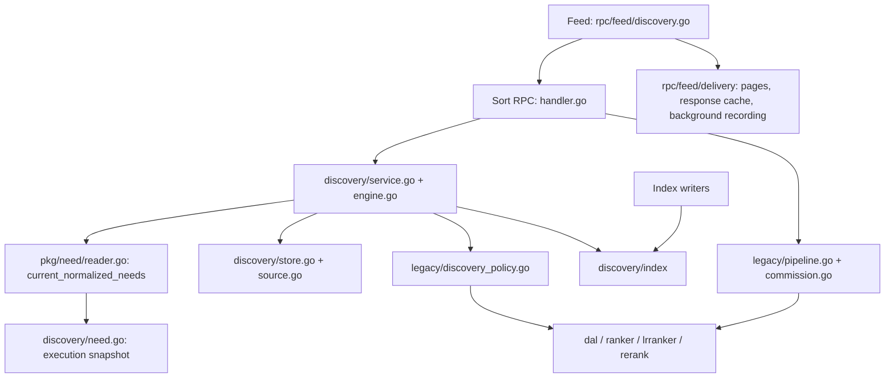

# Sort code review index

Sort owns candidate retrieval, eligibility and ordering. Feed owns delivery,
pagination and exposure recording. The RPC envelopes and rollout switch remain
the external boundaries.

## Entry and composition

| File | Responsibility |
| --- | --- |
| [main.go](main.go) | Process startup, shared infrastructure and shutdown. |
| [wiring.go](wiring.go) | Discovery configuration, clients and engine assembly. |
| [handler.go](handler.go) | RPC authentication guard, JSON envelope adaptation and dispatch. Existing RPC methods are provided by the embedded `legacy.Service`. |

## Search and recommendation

| File or package | Responsibility |
| --- | --- |
| [discovery/service.go](discovery/service.go) | Serving/taxonomy operation dispatch. |
| [discovery/types.go](discovery/types.go) | Typed requests, contexts, candidates and results. |
| [discovery/need.go](discovery/need.go), [pkg/need/reader.go](../../pkg/need/reader.go) | Compile owned current Need projections; preserve input/projection/Intent provenance. |
| [discovery/compiler.go](discovery/compiler.go) | Compile input into executable constraints. |
| [discovery/query.go](discovery/query.go) | Query normalization, script-aware phrase matching, bounded taxonomy alias expansion and retrieval provenance. |
| [discovery/engine.go](discovery/engine.go) | Bounded retrieval, filtering, scoring and policy orchestration; requested recommendation limits and bounded search/legacy Feed prefetch. |
| [discovery/intersect.go](discovery/intersect.go), [filter.go](discovery/filter.go), [score.go](discovery/score.go) | Constraint intersection, eligibility and rule scoring. |
| [discovery/store.go](discovery/store.go) | Immutable PostgreSQL execution snapshots and expiry. |
| [discovery/source.go](discovery/source.go), [source_query.go](discovery/source_query.go) | ES retrieval, broadcast DB hydration, Agent/commission forward reads, and current account/relationship checks. |
| [discovery/index/](discovery/index/) | Shared vocabulary, slot schema, normalization and versioned Redis forward storage. This leaf package is also used by index writers, without importing the execution engine. |
| [discovery/transport/](discovery/transport/) | Shared RPC JSON response encoding and decoding. |

## Existing feed pipeline and policies

| File or package | Responsibility |
| --- | --- |
| [legacy/service.go](legacy/service.go) | Service-owned configuration, caches, recall sources and model manager lifecycle. |
| [legacy/pipeline.go](legacy/pipeline.go) | Existing `SortItems` retrieval and feed-ordering orchestration. |
| [legacy/commission.go](legacy/commission.go) | Existing commission search and recommendation, including exact-ID lookup. |
| [legacy/lr_input.go](legacy/lr_input.go), [context_features.go](legacy/context_features.go), [category_metrics.go](legacy/category_metrics.go) | Feature assembly, model scoring glue and metrics. |
| [legacy/rerank_config.go](legacy/rerank_config.go), [content_class.go](legacy/content_class.go), [inject_claim.go](legacy/inject_claim.go) | Existing policy configuration, content classification and injection claims. |
| [legacy/discovery_policy.go](legacy/discovery_policy.go) | Adapter that applies the existing policy set to discovery candidates. It remains active when discovery is enabled. |
| [dal/](dal/), [ranker/](ranker/), [lrranker/](lrranker/), [rank/](rank/), [rerank/](rerank/) | Existing data readers, formula/model scoring, candidate contract and reusable policies. Replay and other consumers retain these package paths. |

`legacy` identifies the existing orchestration; it is not an independently
removable subsystem because discovery still reuses its policy adapter.

Tests stay beside the package they exercise. Service integration suites remain
under `tests/`; see [testing instructions](../../docs/dev/testing.md).

Unified search pagination and cursor validation live in [delivery/search.go](../feed/delivery/search.go). Sort produces the bounded ranking once; Feed serves frozen pages and records only delivered rows.
