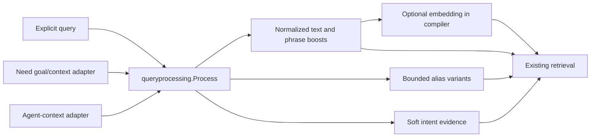

# Query processing

`Process(text, vocabulary, options) -> Analysis` is the deterministic text stage
shared by explicit search queries, Need-derived queries and Agent-context queries.
It owns NFKC/case/whitespace normalization, CJK and Latin phrase boundaries,
reviewed alias expansion, ambiguity handling and bounded retrieval evidence.
It does not read storage, call a model, interpret Need fields or modify filters.

- [processor.go](processor.go): `Options`, `Analysis`, `Expansion` and the text rules.
- [processor_test.go](processor_test.go): multilingual cases, ambiguity, bounds,
  determinism and exact identity protection.
- [../compiler.go](../compiler.go): mandatory invocation in `compileBase`, followed
  by shared `prepareRetrieval` for embeddings and soft intent matching.
- [../need.go](../need.go): maps Need fields to query/filter before processing.
- [../query_test.go](../query_test.go): adapter parity, snapshot round trips and ES
  query integration.

Exact Agent identity resolution uses original input before this stage; its
`Identity` option preserves case and skips rewriting. A numeric Need goal remains
text rather than becoming an exact-ID request. Empty broadcast baseline needs no
text processing. The `query_analysis` JSON contract remains compatible with stored
contexts and replay samples; the original Need JSON remains the source of truth.
