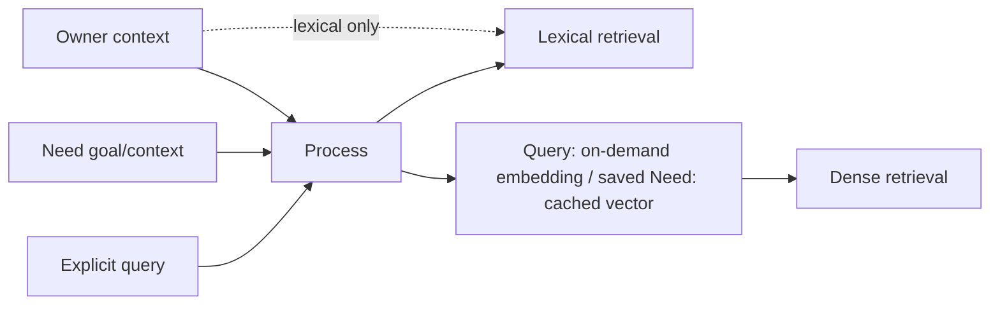

# Query processing

`queryprocessing.Process(text, options)` is the mandatory pure text stage for
explicit searches, Need goal/context text and Agent-context fallback. It owns
NFKC normalization, Unicode case folding, whitespace collapse and script-aware
phrase evidence. It reads no vocabulary, database or model and changes no filter.

Short unspaced CJK queries receive phrase boosts. Latin text uses existing ES
analyzers. Mixed text retains its original meaning; no automatic translation,
alias expansion, simplified/traditional conversion or guessed stemming occurs.
Lexical requests retain original and normalized clauses in a zero-tie `dis_max`.

Identity resolution runs first on original text. `Options.Identity` preserves
case for exact names/IDs. A numeric Need goal remains prose. Empty broadcast
baseline has no text processing. Analysis is frozen in contexts and samples;
`Version` participates in the Need vector cache generation.

```mermaid
flowchart LR
    Query[Explicit query] --> P[Process]
    Need[Need goal/context] --> P
    Owner[Owner context] --> P
    P --> L[Lexical retrieval]
    P --> E[Query: on-demand embedding / saved Need: cached vector]
    E --> D[Dense retrieval]
    Owner -. lexical only .-> L
```

- `processor.go`: processing contract and text rules.
- `processor_test.go`: multilingual normalization and identity protection.
- `../compiler.go`: invokes processing; skips embeddings for Agent context.
- `../need.go`: maps Need fields into query/filter without changing source JSON.
- `../query_test.go`: adapter parity, snapshot and ES query checks.
